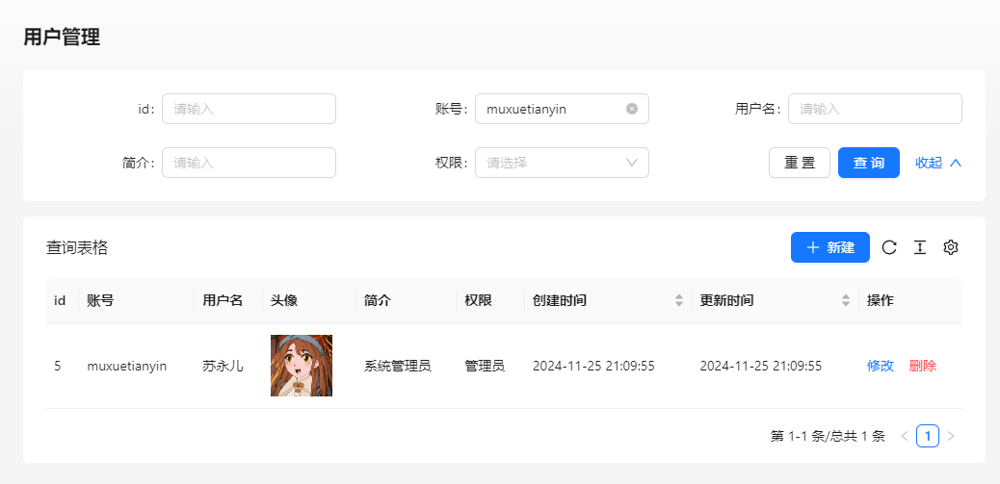
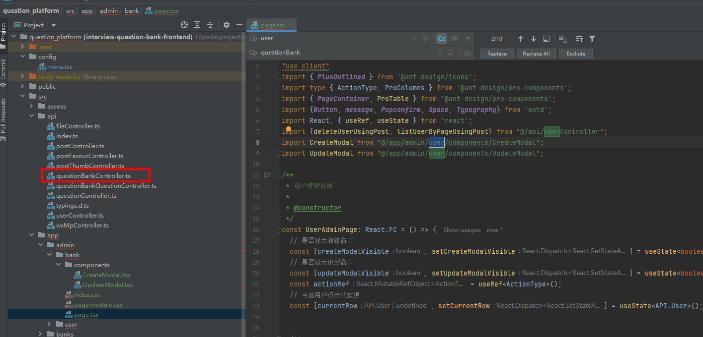
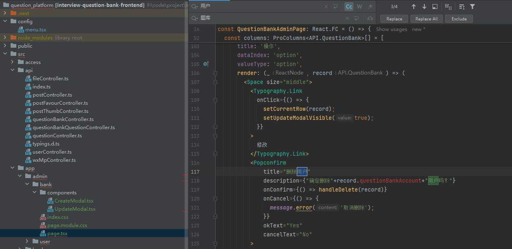
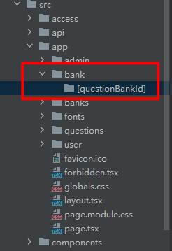

# 1.项目介绍

面试鸭是一款基于 Next.js + Spring Boot + Redis + MySQL + Elasticsearch 的 **面试刷题平台**，运用 Druid + HotKey + Sa-Token + Sentinel 提高了系统的性能和安全性。

管理员可以创建题库、题目和题解，并批量关联题目到题库；用户可以注册登录、分词检索题目、在线刷题并查看刷题记录日历等。

项目涉及大量企业级新技术的讲解，比如使用数据库连接池、热 Key 探测、缓存、高级数据结构来提升性能。通过流量控制、熔断、动态 IP 黑白名单过滤、同端登录冲突检测、分级反爬虫策略来提升系统和内容的安全性。从 0 到 1 的真实企业级项目设计开发，绝对让你收获满满！

### 项目三大阶段

为了帮大家循序渐进地学习，鱼皮将项目设计为三个阶段，可以根据自己的时间和水平按需学习。

1）第一阶段，开发基础的刷题平台，带大家熟悉项目开发流程，实战 Next.js 服务端渲染 + Spring Boot 应用的快速开发。

2）第二阶段，对项目功能进行扩展，精选 4 个真实业务场景，实战企业主流后端技术如 Redis 缓存和高级数据结构、Elasticsearch 搜索引擎、Druid 连接池、并发编程、热 key 探测的应用。

3）第三阶段，对项目安全性进行优化，比如基于 Sentinel 进行网站流量控制和熔断、基于 Nacos 实现动态的 IP 黑白名单、基于 Sa-Token 实现同端登录冲突检测、基于 Redis 实现分级反爬虫策略等。最终将项目上线并保证可用性。

## 1.2、项目优势

### 项目收获

本项目是线上刷题网站[《面试鸭》](https://mianshiya.com/)的教学版本，业务真实典型，基于主流的前端 Next.js 服务端渲染和后端经典技术栈实现。区别于增删改查的 “烂大街” 项目，本项目中鱼皮会带你实战大量新技术和企业级场景、掌握系统设计和优化方案，给你的简历大幅增加竞争力。

鱼皮给大家讲的都是 **通用的项目开发方法和架构设计套路**，从这个项目中你可以学到：

- 如何拆解复杂业务，从 0 开始设计实现系统？
- 如何快速构建 Next.js 服务端渲染网站和后端项目？
- 如何结合 Redis + Caffeine + Hotkey 构建高性能实时缓存？
- 如何利用 Elasticsearch 实现灵活高效的内容搜索？
- 如何巧用 Redisson 高级数据结构，实现高性能的接口？
- 如何实现流量控制和动态 IP 黑白名单，增强网站安全性？
- 如何实现登录冲突检测和分级反爬虫策略，保护网站内容？
- 如何快速上线项目并增强可用性？

此外，还能学会很多作图、思考问题、对比方案的方法，提升排查问题、自主解决 Bug 的能力。

## 1.3、核心业务流程


## 1.4.项目功能梳理

### 基础功能

- 用户模块
- - 用户注册
  - 用户登录（账号密码）
  - 【管理员】管理用户 - 增删改查
- 题库模块
- - 查看题库列表
  - 查看题库详情（展示题库下的题目）
  - 【管理员】管理题库 - 增删改查
- 题目模块
- - 题目搜索
  - 查看题目详情（进入刷题页面）
  - 【管理员】管理题目 - 增删改查（比如按照题库查询题目、修改题目所属题库等）

### 高级功能

- 题目批量管理
- - 【管理员】批量向题库添加题目
  - 【管理员】批量从题库移除题目
  - 【管理员】批量删除题目
- 分词题目搜索
- 用户刷题记录日历图
- 自动缓存热门题目
- 网站流量控制和熔断
- 动态 IP 黑白名单过滤
- 同端登录冲突检测
- 分级题目反爬虫策略

## 1.5技术选型

### 前端

- React 18 框架
- ⭐️ Next.js 服务端渲染
- ⭐️ Redux 状态管理
- Ant Design 组件库
- 富文本编辑器组件
- ⭐️ 前端工程化：ESLint + Prettier + TypeScript
- ⭐️ OpenAPI 前端代码生成

### 后端

- Java Spring Boot 框架 + Maven 多模块构建
- MySQL 数据库 + MyBatis-Plus 框架 + MyBatis X
- Redis 分布式缓存 + Caffeine 本地缓存
- Redission 分布式锁 + BitMap + BloomFilter
- ⭐️ Elasticsearch 搜索引擎
- ⭐️ Druid 数据库连接池 + 并发编程
- ⭐️ Sa-Token 权限控制
- ⭐️ HotKey 热点探测
- ⭐️ Sentinel 流量控制
- ⭐️ Nacos 配置中心
- ⭐️ 多角度项目优化：性能、安全性、可用性

## 1.6、架构设计


## 环境准备

后端 JDK 版本需要使用 8、11 或 17，**不能超过 17！**

推荐使用 11 版本，因为 Caffeine 缓存要求使用 11 版本。

前端 Node.js 版本 >= 18.18。

# 2 - 后端开发

## 2.1、初始化代码

### 下载连接mysql数据库


全选执行


### 更改项目名称

**注意项目名称和包名不能大写**


替换包名


替换，然后搜索


然后执行create_table创建数据库

使用mybatis生成代码


因为原本代码已经存在user类需要自己更改替换

增加  editTime 字段

---

刚生成的几个文件在isDelete字段（是否删除）这里加@TableLogic

```java
    @TableLogic
    private Integer isDelete;
```

在实体类Question，QuestionBank， QuestionBankQuestion

id这里生成策列改一下

```java
    @TableId(type = IdType.ASSIGN_ID)
    private Long id;
```


全局替换库名，然后使用git提交代码


### git初始化代码提交

改完这些已经是你自己的项目了

**测试代码没有问题**就可以提交代码到git了

以后改错了有什么问题可以进行回滚

```
git init
git add .   
或者在根目录选择添加（如下图）
```


然后提交代码


## 2.2.使用代码生成器生成业务代码


题目表

```
        String packageName = "com.muxue.interviewquestion";
        String dataName = "题目";
        String dataKey = "question";
        String upperDataKey = "Question";
```

然后直接点执行


题库表

```
        String packageName = "com.muxue.interviewquestion";
        String dataName = "题库";
        String dataKey = "questionBank";
        String upperDataKey = "QuestionBank";
```

题库题目关联表

```
        String packageName = "com.muxue.interviewquestion";
        String dataName = "题库题目关联表";
        String dataKey = "questionBankQuestion";
        String upperDataKey = "QuestionBankQuestion";
```

复制代码到对应目录

### controller

controller直接可以复制整个文件夹到对应目录


### dto

dto要创建对应的文件夹

这里已question为例

在dto创建文件夹question，复制对应的文件到dto里面


questionBank和questionBankQuestion也一样

### vo

直接复制所有文件到vo文件夹里面

### service

也是和controller一样直接可以复制整个文件夹到对应目录加好


点第三个覆盖所有就好

### 对整理生成的代码进行整理

#### dto和vo，controller

**每一个和实体类对照**确定是否要更多字段添加搜索编辑

如果vo里面的json转换报错就删掉


controller把没有发方法删掉

#### service整理

idea没有安装Generate All Getter And Setter插件可以安装一下

注意需要魔法这里


也可以按下面下载

```
https://plugins.jetbrains.com/plugin/18969-generate-all-getter-and-setter/versions/stable
```


然后选择下载的文件进行安装

使用方法是

```
实体类.allget     就可以一键生成实体类所有字段了
```

在备注报红的，还有不要点赞这些信息就可以删掉了


需要补充就补充一些字段


在这个补充的所有字段里面删除不需要的字段

然后拿到需要的字段来进行查询

## 2.3测试代码

直接访问接口文档进行测试


测试生成的模板中tags需要转换的数据类型都需要加上转换（add,edit,update）

例：editQuestion接口

需要在数据校验前加上，参考post写法

```java
        List<String> tags = questionEditRequest.getTags();
        if (tags != null) {
            question.setTags(JSONUtil.toJsonStr(tags));
        }
```

## 2.4核心业务接口梳理

根据题库查询题目

1.用sql 查询 join连表查询

2.业务层分步查询。要先通过查询关联表得到题目id，再把id放到集合中，根据id使用in查询从题目表查询到题目的完整信息

这里比较简单采用第二种方法

在QuestionQueryRequest加上questionBankId（题库id）

安装流程开发controller和service

是否需要题目列表

QuestionBankQueryRequest加上    

```java
    /**
    *   是否要查询关联题目列表
    * */
    private boolean  needQueryQuestionList;
```

然后在QuestionBankVO类里面加上

返回的题目列表

```java
    /**
     * 题库里的题目列表（分页）
     */
     Page<Question> questionPage;
```

controller

```java
    @GetMapping("/get/vo")
    public BaseResponse<QuestionBankVO> getQuestionBankVOById(QuestionBankQueryRequest questionBankQueryRequest, HttpServletRequest request) {
        Long id = questionBankQueryRequest.getId();
        ThrowUtils.throwIf(id <= 0, ErrorCode.PARAMS_ERROR);
        // 查询数据库
        QuestionBank questionBank = questionBankService.getById(id);
        ThrowUtils.throwIf(questionBank == null, ErrorCode.NOT_FOUND_ERROR);
        QuestionBankVO questionBankVO = questionBankService.getQuestionBankVO(questionBank, request);
        boolean needQueryQuestionList = questionBankQueryRequest.isNeedQueryQuestionList();
        if (needQueryQuestionList){
            QuestionQueryRequest questionQueryRequest = new QuestionQueryRequest();
            questionQueryRequest.setQuestionBankId(id);
            Page<Question> questionPage = questionService.listQuestionByPage(questionQueryRequest);
            questionBankVO.setQuestionPage(questionPage);
        }
        // 获取封装类
        return ResultUtils.success(questionBankVO);
    }
```

修改题目所属数据库接口

添加移除关联表字段

```java
/**
 * 删除题目题库关系请求
 */
@Data
public class QuestionBankQuestionRemoveRequest implements Serializable {
    /**
     * 题库 id
     */
    private Long questionBankId;

    /**
     * 题目 id
     */
    private Long questionId;

    private static final long serialVersionUID = 1L;
}
```

#### 创建题库题目关联

```java
@Override
public void validQuestionBankQuestion(QuestionBankQuestion questionBankQuestion, boolean add) {
    ThrowUtils.throwIf(questionBankQuestion == null, ErrorCode.PARAMS_ERROR);
    // 题目和题库必须存在
    Long questionId = questionBankQuestion.getQuestionId();
    if (questionId != null) {
        Question question = questionService.getById(questionId);
        ThrowUtils.throwIf(question == null, ErrorCode.NOT_FOUND_ERROR, "题目不存在");
    }
    Long questionBankId = questionBankQuestion.getQuestionBankId();
    if (questionBankId != null) {
        QuestionBank questionBank = questionBankService.getById(questionBankId);
        ThrowUtils.throwIf(questionBank == null, ErrorCode.NOT_FOUND_ERROR, "题库不存在");
    }
}
```

因为 QuestionService 和 QuestionBankQuestionService 互相引用，会导致循环依赖问题，让项目无法启动。可以通过给 QuestionBankQuestionServiceImpl 中引用 QuestionService 的位置加上 `@Lazy` 注解解决。

```java
@Resource
@Lazy
private QuestionService questionService;
```


# 3.前端模板开发

## 本项目选型

- React 18 框架
- ⭐️ Next.js 服务端渲染
- ⭐️ Redux 状态管理
- Ant Design 组件库
- 富文本编辑器组件
- ⭐️ 前端工程化：ESLint + Prettier + TypeScript
- ⭐️ OpenAPI 前端代码生成

## 服务端渲染介绍

#### 1、什么是客户端和服务端渲染？

网站渲染可以在服务端和客户端两种环境下进行。

服务端渲染（Server-Side Rendering，SSR） 是一种将网页在 **服务器端** 生成并渲染为 HTML 内容的技术。在这种方式下，当用户请求一个网页时，服务器会提前调用后端能获取数据并生成完整的 HTML 文档，然后将其发送到客户端（浏览器）。浏览器接收到 HTML 后，直接展示页面内容，不用再动态地向后端发送请求来获取数据。

服务端渲染的工作流程通常如下：

1. 用户发送请求到服务器
2. 服务器处理请求，调用后端获取数据，并生成完整的 HTML 页面
3. 服务器将生成的 HTML 页面返回给客户端（浏览器）
4. 浏览器接收到 HTML 后，直接渲染页面

#### 2、客户端和服务端渲染的区别？

客户端渲染和服务端渲染的主要区别在于渲染过程发生的地点。

由于 Ajax、Vue、React 等新技术的崛起，大多数学前端的同学开发的网站都是基于客户端渲染实现的，客户端渲染的优点主要是：

1. 开发方便灵活：开发者不需要区分哪些数据要在服务端加载、哪些数据要在客户端加载，也不用担心哪些 API 无法在服务端使用。便于实现更加复杂和动态的用户界面，适合构建单页应用（SPA）和需要频繁交互的应用。
2. 减少服务器压力：由于渲染工作由客户端（用户自己的电脑）完成，因此服务器的负载相对较小，只需要提供静态资源（比如使用 Nginx 就能完成部署）。

以我们的 [编程导航网站](https://www.code-nav.cn/) 为例，就使用了客户端渲染，可以看到刚开始加载的 HTML 文档并不包含网站的数据，只有一个标题、以及一个 JS 脚本。

而我们的 [面试刷题网站 - 面试鸭](https://www.mianshiya.com/) 使用的是服务端渲染，可以看到，服务端返回的 HTML 文档中，就已经有完整的网站数据和样式了：

1. 减少初始加载时间：SSR 页面可以在首次加载时展示完整内容，减少白屏时间，而 CSR 通常需要等待 JavaScript 加载和执行后才能展示内容。
2. SEO 友好：SSR 更有利于 SEO，因为搜索引擎爬虫能够直接抓取完整页面的内容，而不依赖于 JavaScript 执行。

但相应的，SSR 将渲染任务交给服务器，可能会增加服务器的负载和压力。所以 SSR 更适合追求性能和 SEO 的企业级项目。

能够实现服务端渲染的技术很多，以前有 Java 的 JSP、PHP 等等，现在有基于 React 的 Next.js 和基于 Vue 的 Nuxt.js 框架，可以让你直接用前端的语法开发服务端渲染项目。

#### 3、其他渲染方式 - 静态网站生成

静态网站生成（Static Site Generation，SSG）是一种在构建阶段生成静态 HTML 文件的技术。与服务端渲染不同，静态网站生成是在构建时（而不是用户请求时）生成页面，所有页面都以静态文件的形式存在。

这种方式本质上也是客户端渲染，但是不需要由客户端再动态地向后端发送请求来获取数据，这些静态文件可以直接由内容分发网络（CDN）或静态服务器提供。

优点：

1. 高性能：由于服务器仅需提供静态文件，性能极高；而且由于数据不变化，特别适合通过 CDN 缓存加速。
2. SEO 友好：搜索引擎最喜欢的就是静态 HTML 文件，可以轻松索引并提升 SEO 效果。
3. 简化基础设施：无需复杂的前后端交互逻辑，静态文件的部署和维护成本较低。

缺点：

1. 动态内容有限：SSG 适合内容变化不频繁的场景，对于需要实时更新内容的网站，生成静态页面可能不够灵活。
2. 构建时间：生成大量静态页面时，构建时间可能较长，特别是数据量大的时候。

基于这些优缺点，静态网站生成适合内容数量有限的、内容基本不变的网站，比如个人博客。像 VuePress、Hugo、Hexo、Astro 都是主流的静态网站生成器。

[鱼皮的编程宝典](https://www.codefather.cn/) 就是基于 VuePress 开发的，模板也开源到了 GitHub 上：https://github.com/liyupi/codefather

随着静态网站内容越来越多，每次构建会越来越慢，这种情况下，可以采用增量静态生成技术。

增量静态生成（Incremental Static Regeneration，ISR）允许部分页面在构建之后进行更新，而无需重新构建整个站点。这种技术适用于那些大多数内容不变、但某些部分需要动态更新的网站。

工作流程：

1. 在构建阶段，生成初始的静态页面。
2. 当页面内容更新时，通过配置的再生成间隔，静态页面可以增量更新，而不是重新生成整个站点，大幅减少构建时间。
3. 用户请求时，如果页面内容过期或更新，则后台自动生成新的静态页面并缓存。

这样一来，可以在享受静态网站高性能、SEO 友好特性的同时，及时更新网站的内容，并减少构建时间。

不过缺点就是架构更复杂、维护成本更高。但值得一提的是，很多大型网站为了做 SEO 优化，专门把动态网站转为静态 HTML（静态化）。

#### 4、结合使用（推荐）

实际情况下，前面讲到的几种方式可以结合使用。

比如 **部分预渲染**（Partial Prerendering，PPR）是一种将服务端渲染（或静态生成）与客户端渲染结合的技术。

工作流程：

1. 在构建阶段或请求阶段，页面的静态部分预先渲染（如导航栏、页脚等）。
2. 页面加载时，静态部分直接显示，动态部分由 JavaScript 在客户端加载并渲染。
3. 通过水合（Hydration）过程，客户端的 JavaScript 接管已经渲染的静态内容，并继续处理动态交互。

这样一来，兼具了 SSR 的 SEO 友好和快速初始加载、以及 CSR 灵活动态交互的优点。

还有一个跟部分预渲染相似的概念叫 **同构渲染** ，是指同一套代码可以在服务端和客户端运行，并在服务端渲染页面的初始内容，然后在客户端接管渲染和交互。

实际情况下鱼皮也更推荐用这种方式，本项目鱼皮也会带大家使用主流的、新版本的 Next.js 框架实现同构渲染。下面先从 0 开始带大家做一个基于 Next.js 的前端万用项目模板。

## Next.js 前端万用模板开发

自主打造一套前端开发项目模板！

### 确认环境！！！

打开 Next.js 的官方文档：https://nextjs.org/docs/getting-started/installation （注意不要看成国内的文档了，不够新）

本次我们要使用的是 14 版本的 Next.js，可以看到 Node.js 的版本要求必须 >= 18.18，一定要注意！


### 创建项目

直接按照官方文档的指引，使用 Npm 自带的 Npx 脚手架工具 `create-next-app` 来自动安装 Next.js 初始化项目：https://nextjs.org/docs/getting-started/installation#automatic-installation

在需要安装的文件夹内执行安装命令：

```
npx create-next-app@latest
```

由于 Ant Design 5.x 只支持react18版本  最新的next为15.0.3我们需要指定版本安装

```
npx create-next-app@14.2.18
```


脚手架会自动生成代码并安装依赖，如果安装依赖卡住，可能需要更换 Npm 镜像为国内源：

```
npm config set registry https://registry.npmmirror.com/
```

完成后打开

进入项目运行项目打开出现页面


### 前端工程化配置

脚手架已经帮我们配置了 ESLint 自动校验、TypeScript 类型校验，但一般情况下，我们还需要代码自动格式化插件 Prettier，需要手动整合。

整合多个工具时，很容易出现版本冲突的问题，尤其是 ESlint 和 Prettier 整合时，校验规则可能也会存在冲突。所以最好按照官方文档的指引，比如：https://nextjs.org/docs/app/api-reference/config/eslint


```shell
npm install --save-dev eslint-config-prettier
 
yarn add --dev eslint-config-prettier
 
pnpm add --save-dev eslint-config-prettier
 
bun add --dev eslint-config-prettier
```

先去官网安装 prettier（ https://prettier.io/docs/en/install ），执行命令：

```shell
npm install --save-dev --save-exact prettier
```

然后通过命令安装整合包 eslint-config-prettier：

```json
{
  "extends": ["next/core-web-vitals", "next/typescript","prettier"]
}
```

然后在编辑器中搜索prettier


在任意一个 tsx 文件中执行格式化快捷键（Ctrl + Alt + L），不报错，表示配置工程化成功。

修改 .eslintrc.json 文件可以改变校验规则，一般自己做项目不需要修改，具体可以到 ESLint 和 Prettier 的官方文档查看。

如果不使用脚手架，就需要自己按照下面这些文档整合这些工具：

- 代码规范：https://eslint.org/docs/latest/use/getting-started
- 代码美化：https://prettier.io/docs/en/install.html
- 直接整合：https://github.com/prettier/eslint-plugin-prettier#recommended-configuration （包括了 https://github.com/prettier/eslint-config-prettier#installation ）

### 引入组件库

1）Ant Design 是 React 项目主流的组件库，Ant Design Procomponents 是在此基础上进一步封装的高级业务组件库，一般的项目使用这两个就足够了，我们的 [面试鸭](https://www.mianshiya.com/) 用的就是这些，完全满足需求。

参考官方文档在 Next.js 项目中引入 Ant Design 5.x 版本的组件库：https://ant-design.antgroup.com/docs/react/use-with-next-cn

引入 antd

```
npm install antd --save
```

使用 App Router以避免页面闪动的情况

```
npm install @ant-design/nextjs-registry --save
```

在 `app/layout.tsx` 中使用

```jsx
// import type {Metadata} from "next";
import localFont from "next/font/local";
import "./globals.css";
import { AntdRegistry } from '@ant-design/nextjs-registry';

const geistSans = localFont({
    src: "./fonts/GeistVF.woff",
    variable: "--font-geist-sans",
    weight: "100 900",
});
const geistMono = localFont({
    src: "./fonts/GeistMonoVF.woff",
    variable: "--font-geist-mono",
    weight: "100 900",
});


// 网页的标题描述
// export const metadata: Metadata = {
//     title: "Create Next App",
//     description: "Generated by create next app",
// };


export default function RootLayout({
                                       children,
                                   }: Readonly<{
    children: React.ReactNode;
}>) {
    return (
        <html lang="en">
        <body className={`${geistSans.variable} ${geistMono.variable}`}>
        <AntdRegistry>{children}</AntdRegistry>
        </body>
        </html>
    );
}
```

引入之后找一个组件测试一下是否引入成功

我这里在page页面引入一个基础按钮测试

```
import {Button} from "antd";

<Button type="primary">Primary Button</Button>
```

我们还可以引入 Ant Design Procomponents

文档：https://procomponents.ant.design/docs/

ProComponents 每一个组件都是一个独立的包，你需要在你的项目中安装对应的 npm 包并使用。

```
npm i @ant-design/pro-components --save
```

精减globals.css全局样式

```css
html,
body {
  max-width: 100vw;
  min-height: 100vh;
}
* {
  box-sizing: border-box;
  padding: 0;
  margin: 0;
}

a {
  color: inherit;
  text-decoration: none;
}
```

在根目录新建public/assets存放静态资源

src/layouts/BasicLayout

```tsx
"use client"
import {GithubFilled, InfoCircleFilled, LogoutOutlined, QuestionCircleFilled, SearchOutlined,} from '@ant-design/icons';
import {ProConfigProvider, ProLayout,} from '@ant-design/pro-components';
import {Dropdown, Input, theme,} from 'antd';
import React from 'react';
import {Props} from "next/script";
import Image from "next/image";
import {usePathname} from "next/navigation";
import Link from "next/link";
import GlobalFooter from "@/components/GlobalFooter";
import "./index.css"
import {menus} from "../../../../config/menu";

const SearchInput = () => {
    const {token} = theme.useToken();
    return (
        <div
            key="SearchOutlined"
            aria-hidden
            style={{
                display: 'flex',
                alignItems: 'center',
                marginInlineEnd: 24,
            }}
            onMouseDown={(e) => {
                e.stopPropagation();
                e.preventDefault();
            }}
        >
            <Input
                style={{
                    borderRadius: 4,
                    marginInlineEnd: 12,
                    backgroundColor: token.colorBgTextHover,
                }}
                prefix={
                    <SearchOutlined
                        style={{
                            color: token.colorTextLightSolid,
                        }}
                    />
                }
                placeholder="搜索方案"
                variant="borderless"
            />
        </div>
    );
};

export default function BasicLayout({children}: Props): React.ReactElement {

    const pathname = usePathname()

    return (
        <div
            id="test-pro-layout"
            style={{
                height: '100vh',
                overflow: 'auto',
            }}
        >
            <ProConfigProvider hashed={false}>
                <ProLayout
                    prefixCls="my-prefix"
                    location={{
                        pathname,
                    }}
                    token={{
                        header: {
                            // colorBgMenuItemSelected: 'rgba(0,0,0,0.04)',
                            colorBgMenuItemHover: 'rgba(0,0,0,0.0)',
                            colorTextMenuSecondary: 'rgba(255,255,255,0.65)',
                            colorTextMenuActive: 'rgba(213,213,213,0.95)',
                        },
                    }}
                    layout={'top'}
                    title={"面试刷题平台"}
                    logo={
                        <Image src="/assets/logo.png" width={32} height={32} alt={"muxuetianyin-刷题网站"}/>
                    }
                    siderMenuType="group"
                    menu={{
                        collapsedShowGroupTitle: true,
                    }}
                    fixedHeader={true}
                    avatarProps={{
                        src: 'https://gw.alipayobjects.com/zos/antfincdn/efFD%24IOql2/weixintupian_20170331104822.jpg',
                        size: 'small',
                        title: '七妮妮',
                        render: (props, dom) => {
                            return (
                                <Dropdown
                                    menu={{
                                        items: [
                                            {
                                                key: 'logout',
                                                icon: <LogoutOutlined/>,
                                                label: '退出登录',
                                            },
                                        ],
                                    }}
                                >
                                    {dom}
                                </Dropdown>
                            );
                        },
                    }}
                    actionsRender={(props) => {
                        if (props.isMobile) return [];
                        // if (typeof window === 'undefined') return [];
                        return [
                            props.layout !== 'side' && document.body.clientWidth > 1400 ? (
                                <SearchInput/>
                            ) : undefined,
                            <InfoCircleFilled key="InfoCircleFilled"/>,
                            <QuestionCircleFilled key="QuestionCircleFilled"/>,
                            <GithubFilled key="GithubFilled"/>,
                        ];
                    }}
                    headerTitleRender={(logo, title) => {
                        const defaultDom = (
                            <a>
                                {logo}
                                {title}
                            </a>
                        );
                        // if (typeof window === 'undefined') return defaultDom;
                        // if (document.body.clientWidth < 1400) {
                        //     return defaultDom;
                        // }
                        // if (_.isMobile) return defaultDom;
                        return (
                            <>
                                {defaultDom}
                            </>
                        );
                    }}
                    footerRender={() => {
                        return (
                           <GlobalFooter/>
                        );
                    }}
                    onMenuHeaderClick={(e) => console.log(e)}
                    menuDataRender={() => {
                        return menus
                    }}
                    menuItemRender={(item, dom) => (
                        <Link
                            href={item.path || "/"}
                            target={item.target}
                        >
                            {dom}
                        </Link>
                    )}
                >
                    {children}
                </ProLayout>
            </ProConfigProvider>
        </div>

    );
};
```

src/layouts/BasicLayout/index.css

```css
.ant-pro-layout .ant-pro-layout-content {
    padding-bottom: 96px !important;
}
```

项目根目录/config/menus

```tsx
import {MenuDataItem} from "@umijs/route-utils";
import {CrownOutlined} from "@ant-design/icons";

// 菜单列表
export const menus = [
    {
        path: '/',
        name: '主页'
    },
    {
        path: 'questions',
        name: '题目'
    },
    {
        path: 'banks',
        name: '题库'
    },
    {
        path: "/admin",
        name: "管理",
        icon: <CrownOutlined />,
        children: [
            {
                path: "/admin/user",
                name: "用户管理",
            }
        ],
    },
] as MenuDataItem[];
```

全局底部栏组件

src/components/GlobalFooter

```tsx
import React from "react";
import './index.css'

/**
 * 全局底部栏组件
 * @constructor
 */


export default function GlobalFooter() {
    const currentYear = new Date().getFullYear();
    return (
        <div
            className="global-footer"
        >
            <div>© {currentYear} 面试猫</div>
            <div>
                <a href="https://www.muxuetianyin.cn" target="_blank" rel="noopener noreferrer">
                    muxuetianyin-苏永儿
                </a>
            </div>
        </div>
    );
}
```

src/components/GlobalFooter/index.css

```css
.global-footer{
    position: fixed;
    bottom: 0;
    text-align: center;
    background-color: #f2f2f2;
    padding: 16px;
    width: 100%;
}
```

配置src/app/layout.tsx

```tsx
// import type {Metadata} from "next";
import localFont from "next/font/local";
import { AntdRegistry } from '@ant-design/nextjs-registry';
import BasicLayout from "@/app/layouts/BasicLayout";
import "./globals.css";

const geistSans = localFont({
    src: "./fonts/GeistVF.woff",
    variable: "--font-geist-sans",
    weight: "100 900",
});
const geistMono = localFont({
    src: "./fonts/GeistMonoVF.woff",
    variable: "--font-geist-mono",
    weight: "100 900",
});


// 网页的标题描述
// export const metadata: Metadata = {
//     title: "Create Next App",
//     description: "Generated by create next app",
// };


export default function RootLayout({
                                       children,
                                   }: Readonly<{
    children: React.ReactNode;
}>) {
    return (
        <html lang="en">
        <body className={`${geistSans.variable} ${geistMono.variable}`}>
        <AntdRegistry>
        <BasicLayout>
            {children}
        </BasicLayout>
        </AntdRegistry>
        </body>
        </html>
    );
}
```


### 引入asiox

src/libs/request.ts

```ts
import axios from "axios";

// 创建 Axios 示例
const myAxios = axios.create({
  baseURL: "http://localhost:8101",
  timeout: 10000,
  withCredentials: true,
});

// 创建请求拦截器
myAxios.interceptors.request.use(
  function (config) {
    // 请求执行前执行
    return config;
  },
  function (error) {
    // 处理请求错误
    return Promise.reject(error);
  },
);

// 创建响应拦截器
myAxios.interceptors.response.use(
  // 2xx 响应触发
  function (response) {
    // 处理响应数据
    const { data } = response;
    // 未登录
    if (data.code === 40100) {
      // 不是获取用户信息接口，或者不是登录页面，则跳转到登录页面
      if (
        !response.request.responseURL.includes("user/get/login") &&
        !window.location.pathname.includes("/user/login")
      ) {
        window.location.href = `/user/login?redirect=${window.location.href}`;
      }
    } else if (data.code !== 0) {
      // 其他错误
      throw new Error(data.message ?? "服务器错误");
    }
    return data;
  },
  // 非 2xx 响应触发
  function (error) {
    // 处理响应错误
    return Promise.reject(error);
  },
);

export default myAxios;
```

### 自动生成请求代码

传统情况下，每个请求都要单独编写代码，很麻烦。

推荐使用 OpenAPI 工具，直接自动生成即可：https://www.npmjs.com/package/@umijs/openapi

按照官方文档的步骤，先安装：

```
npm i --save-dev @umijs/openapi
```

在 **项目根目录** 新建 `openapi.config.ts`，根据自己的需要定制生成的代码：

```ts
const { generateService } = require("@umijs/openapi");

generateService({
  requestLibPath: "import request from '@/libs/request'",
  schemaPath: "http://localhost:8101/api/v2/api-docs",
  serversPath: "./src",
});
```

在 package.json 的 script 中添加 `"openapi": "ts-node openapi.config.ts"`

```
npm install -g ts-node  
```

运行openapi


这样说明运行成功了

### 初始化页面

可以将单次调用的函数封装成组件像ant design包裹

```jsx
const InitLayout: React.FC<Readonly<{
    children: React.ReactNode;
}>> = ({children}) => {

    /**
     * 全局初始化函数，有单次调用的代码
     */
    // useCallback 缓存函数  []中的变量不发生改变就不会出现渲染
    const doInit = useCallback(() => {
        console.log("init")
    }, [])

    // 在next.js中开发环境useEffect会执行两次
    useEffect(() => {
        doInit()
    }, []);

    return (
        children
    )
}
```

RootLayout

```jsx
export default function RootLayout({
                                       children,
                                   }: Readonly<{
    children: React.ReactNode;
}>) {


    return (
        <html lang="en">
        <body className={`${geistSans.variable} ${geistMono.variable}`}>
        <AntdRegistry>
            <InitLayout>
                <BasicLayout>
                    {children}
                </BasicLayout>
            </InitLayout>
        </AntdRegistry>
        </body>
        </html>
    );
}
```

### 全局状态管理

#### 1、什么是全局状态管理？

是指多个页面需要共享或者跟踪变化的变量，可以放到全局来统一维护，而不是每个页面分别维护和获取。

适合作为全局状态的数据：已登录用户信息（每个页面几乎都要用）1668065268082946050_0.4089253679568121

在 Vue 中，主流的状态管理库有 Vuex 和 Pinia；在 React 项目中，主流的状态管理库是 Redux，本项目也将使用它。

#### 2、Redux 基本概念

React Redux 官方文档：https://react-redux.js.org

Redux 中有一些常用的核心概念，不用理解，简单了解一下即可。

1）Store：整个应用状态（state）的容器，负责存储应用的状态，并提供访问状态、派发（dispatch）动作以及注册监听器等功能。

2）Action：一个普通的 JavaScript 对象，描述了状态变化的意图。每个 `action` 必须包含一个 `type` 字段，表示动作类型。1668065268082946050_0.35505414725423856

一般开发中，我们会用一个字符串常量（Action Types）来标识不同的动作类型。比如改变计数器需要的 increment 或 decrement：

```
const INCREMENT = 'INCREMENT';
const DECREMENT = 'DECREMENT';
```

还会用 Action Creators 动作创建器函数来生成 action 对象，比如：

```tsx
const increment = () => ({
  type: INCREMENT,
});

const decrement = () => ({
  type: DECREMENT,
});
```

3）Dispatch：用于发送 action，触发状态更新。

4）Reducer：俗称状态处理器，根据当前状态和传入的 action 返回新的状态的函数。比如：

```tsx
const initialState = { count: 0 };

function counterReducer(state = initialState, action) {
  switch (action.type) {
    case INCREMENT:
      return { ...state, count: state.count + 1 };
    case DECREMENT:
      return { ...state, count: state.count - 1 };
    default:
      return state;
  }
}
```

安装

```
npm install @reduxjs/toolkit react-redux
```

在src/stores

index.ts

```ts
import { configureStore } from "@reduxjs/toolkit";

const store = configureStore({
  reducer: {
    // 在这里存放状态
  },
});

// 用于类型推断和提示
export type RootState = ReturnType<typeof store.getState>
export type AppDispatch = typeof store.dispatch

export default store;

```

查看文档在全局入口AntdRegistry组件下包一层组件

```tsx
"use client";
import localFont from "next/font/local";
import {AntdRegistry} from '@ant-design/nextjs-registry';
import BasicLayout from "@/layouts/BasicLayout";
import React, {useCallback, useEffect} from "react";
import {Provider} from "react-redux";
import store from "@/stores";
import "./globals.css";


const geistSans = localFont({
    src: "./fonts/GeistVF.woff",
    variable: "--font-geist-sans",
    weight: "100 900",
 });
const geistMono = localFont({
    src: "./fonts/GeistMonoVF.woff",
    variable: "--font-geist-mono",
    weight: "100 900",
});


// 网页的标题描述
// export const metadata: Metadata = {
//     title: "Create Next App",
//     description: "Generated by create next app",
// };


const InitLayout: React.FC<Readonly<{
    children: React.ReactNode;
}>> = ({children}) => {

    /**
     * 全局初始化函数，有单次调用的代码
     */
    // useCallback 缓存函数  []中的变量不发生改变就不会出现渲染
    const doInit = useCallback(() => {
        console.log("init")
    }, [])

    // 在next.js中开发环境useEffect会执行两次
    useEffect(() => {
        doInit()
    }, []);

    return (
        children
    )
}


export default function RootLayout({
                                       children,
                                   }: Readonly<{
    children: React.ReactNode;
}>) {


    return (
        <html lang="en">
        <body className={`${geistSans.variable} ${geistMono.variable}`}>
        <AntdRegistry>
            <Provider store={store}>
                <InitLayout>
                    <BasicLayout>
                        {children}
                    </BasicLayout>
                </InitLayout>
            </Provider>
        </AntdRegistry>
        </body>
        </html>
    );
}
```

在stores目录新建loginUser.ts

```ts
import { createSlice, PayloadAction } from "@reduxjs/toolkit";
// import { RootState } from "@/stores/index";

// 默认用户
const DEFAULT_USER: API.LoginUserVO = {
    userName: "未登录",
    userProfile: "暂无简介",
    userAvatar: "/assets/notLoginUser.png",
    userRole: "guest",
};

/**
 * 登录用户全局状态
 */
export const loginUserSlice = createSlice({
    name: "loginUser",
    initialState: DEFAULT_USER,
    reducers: {
        // 自定义全局状态名称 : (state, action) =>
        setLoginUser: (state, action: PayloadAction<API.LoginUserVO>) => {
            // action.payload 传入的值
            return {
                ...action.payload,
            };
        },
    },
});

// 修改状态
export const { setLoginUser } = loginUserSlice.actions;

export default loginUserSlice.reducer;
```

在stores中引入

```ts
import { configureStore } from "@reduxjs/toolkit";
import loginUser from "@/stores/loginUser";

const store = configureStore({
    reducer: {
        // 在这里存放状态
        loginUser,
    },
});

// 用于类型推断和提示
export type RootState = ReturnType<typeof store.getState>
export type AppDispatch = typeof store.dispatch

export default store;

```

使用测试

```tsx
const InitLayout: React.FC<Readonly<{
    children: React.ReactNode;
}>> = ({children}) => {

     const dispatch = useDispatch<AppDispatch>();

    /**
     * 全局初始化函数，有单次调用的代码
     */
    // useCallback 缓存函数  []中的变量不发生改变就不会出现渲染
    const doInitLoginUser = useCallback( async() => {
        const res = await getLoginUserUsingGet()
        if (res.data){
        //   更新全局用户状态
        } else {
            setTimeout(()=>{
                const test = {userName: "test", id: 1,userAvatar: "/assets/defaultUserAvatar.png"};
                dispatch(setLoginUser(test));
            },3000)
        }
    }, [])

    // 在next.js中开发环境useEffect会执行两次
    useEffect(() => {
        doInitLoginUser()
    }, []);

    return (
        children
    )
}
```

有些目录可以不用全局初始化状态

```ts
// 获取当前页面路径
const pathname = usePathname();

// 登录和注册页不用获取登录信息
if (
  !pathname.startsWith("/user/login") &&
  !pathname.startsWith("/user/register")
) {
  ...
}

```


### 全局权限管理

能让管理员灵活配置每个页面所需的用户权限，由全局管理系统自动拦截和校验，而不需要在每个页面中编写权限校验代码，提高开发效率

还要能够根据权限控制导航菜单的隐藏，只有具有权限的菜单，才对用户可见

#### 1.编写页面权限校验

在app目录下新建forbidden无权限页面

```ts
import { Result, Button } from "antd";
import React from "react";

/**
 * 无权限访问
 * @constructor
 */
const Forbidden = () => {
  return (
    <Result
      status="403"
      title="403"
      subTitle="抱歉，您无权访问此页面。 "
      extra={
        <Button type="primary" href="/">
          返回主页
        </Button>
      }
    />
  );
};

export default Forbidden;

```

在src/access目录下accessEnum.ts

```ts
/**
 * 权限定义
 */
const ACCESS_ENUM = {
  NOT_LOGIN: "notLogin",
  USER: "user",
  ADMIN: "admin",
};

export default ACCESS_ENUM;
```

可以将全局状态中的默认用户权限改为未登录

```ts
const DEFAULT_USER: API.LoginUserVO = {
  userName: "未登录",
  userProfile: "暂无简介",
  userAvatar: "/assets/notLoginUser.png",
  userRole: AccessEnum.NOT_LOGIN,
};
```

可以将menu.tsx加上权限判断

```ts
{
  path: "/admin",
  name: "管理",
  icon: <CrownOutlined />,
  access: ACCESS_ENUM.ADMIN,
  children: [
    {
      path: "/admin/user",
      name: "用户管理",
      access: ACCESS_ENUM.ADMIN,
    },
  ],
},
```

```tsx
// 根据路径查找所有菜单
export const findAllMenuItemByPath = (path: string): MenuDataItem | null => {
    return findMenuItemByPath(menus, path);
};

// 根据路径查找菜单
export const findMenuItemByPath = (
    menus: MenuDataItem[],
    path: string,
): MenuDataItem | null => {
    for (const menu of menus) {
        if (menu.path === path) {
            return menu;
        }
        if (menu.children) {
            const matchedMenuItem = findMenuItemByPath(menu.children, path);
            if (matchedMenuItem) {
                return matchedMenuItem;
            }
        }
    }
    return null;
};
```

在access目录下新建checkAccess.ts

```ts
import ACCESS_ENUM from "@/access/accessEnum";


const checkAccess = (
    loginUser: API.LoginUserVO,
    needAccess= ACCESS_ENUM.NOT_LOGIN,
)=>{
    //获取当前登录用户具有的权限（如果没有登录，则表示没有权限）
     const loginUserAccess = loginUser?.userRole ?? ACCESS_ENUM.NOT_LOGIN
    //如果没有登录不需要如何权限
    if (needAccess === loginUserAccess) {
        return true;
    }
//   如果需要登录才能访问
    if (needAccess === ACCESS_ENUM.USER) {
    //     如果用户未登录，表示无权限
        if (loginUserAccess === ACCESS_ENUM.NOT_LOGIN) {
            return false;
        }
    }
    //如果需要管理员权限才能使用
    if (needAccess === ACCESS_ENUM.ADMIN) {
    //     如果不是管理员，表示无权限
        if (loginUserAccess !== ACCESS_ENUM.ADMIN) {
            return false;
        }
    }
    return true;
}

export default checkAccess;import ACCESS_ENUM from "@/access/accessEnum";


const checkAccess = (
    loginUser: API.LoginUserVO,
    needAccess= ACCESS_ENUM.NOT_LOGIN,
)=>{
    //获取当前登录用户具有的权限（如果没有登录，则表示没有权限）
     const loginUserAccess = loginUser?.userRole ?? ACCESS_ENUM.NOT_LOGIN
    //如果没有登录不需要如何权限
    if (needAccess === loginUserAccess) {
        return true;
    }
//   如果需要登录才能访问
    if (needAccess === ACCESS_ENUM.USER) {
    //     如果用户未登录，表示无权限
        if (loginUserAccess === ACCESS_ENUM.NOT_LOGIN) {
            return false;
        }
    }
    //如果需要管理员权限才能使用
    if (needAccess === ACCESS_ENUM.ADMIN) {
    //     如果不是管理员，表示无权限
        if (loginUserAccess !== ACCESS_ENUM.ADMIN) {
            return false;
        }
    }
    return true;
}

export default checkAccess;
```

AccessLayout.tsx

```tsx
import { useSelector } from "react-redux";
import { RootState } from "@/stores";
import { usePathname } from "next/navigation";
import checkAccess from "@/access/checkAccess";
import Forbidden from "@/app/forbidden";
import React from "react";
import { findAllMenuItemByPath } from "../../config/menus";
import AccessEnum from "@/access/accessEnum";

/**
 * 统一权限校验拦截器
 * @param children
 * @constructor
 */
const AccessLayout: React.FC<
  Readonly<{
    children: React.ReactNode;
  }>
> = ({ children }) => {
  const pathname = usePathname();
  const loginUser = useSelector((state: RootState) => state.loginUser);
  // 权限校验
  const menu = findAllMenuItemByPath(pathname) || {};
  const needAccess = menu?.access ?? AccessEnum.NOT_LOGIN;
  const canAccess = checkAccess(loginUser, needAccess);
  if (!canAccess) {
    return <Forbidden />;
  }
  return <>{children}</>;
};

export default AccessLayout;
```

在RootLayout套一层引入

AccessLayout和BasicLayout可以替换决定权限控制是否看到导航栏

```tsx
        <html lang="en">
        <body className={`${geistSans.variable} ${geistMono.variable}`}>
        <AntdRegistry>
            <Provider store={store}>
                <InitLayout>
                    <BasicLayout>
                        <AccessLayout>
                            {children}
                        </AccessLayout>
                    </BasicLayout>
                </InitLayout>
            </Provider>
        </AntdRegistry>
        </body>
        </html>
```

#### 2.根具权限过滤菜单

menuAccess.ts

```ts
import checkAccess from "@/access/checkAccess";
import { menus } from "../../config/menus";

/**
 * 获取有权限、可访问的菜单
 * @param loginUser
 * @param menuItems
 */
const getAccessibleMenus = (loginUser: API.LoginUserVO, menuItems = menus) => {
  return menuItems.filter((item) => {
    if (!checkAccess(loginUser, item.access)) {
      return false;
    }
    if (item.children) {
      item.children = getAccessibleMenus(loginUser, item.children);
    }
    return true;
  });
};

export default getAccessibleMenus;
```

在BasicLayout中过滤和设置登录状态

```ts
                    menuDataRender={() => {
                        return getAccessibleMenus(loginUser,menus);
                    }}
```

```tsx
                   avatarProps={{
                        src: loginUser.userAvatar,
                        size: 'small',
                        title: loginUser.userName,
                        render: (props, dom) => {
                            return (
                                <Dropdown
                                    menu={{
                                        items: [
                                            {
                                                key: 'logout',
                                                icon: <LogoutOutlined/>,
                                                label: '退出登录',
                                            },
                                        ],
                                    }}
                                >
                                    {dom}
                                </Dropdown>
                            );
                        },
                    }}
```

扩展

hoc组件使用，更灵活

```ts
// components/withAuth.js
import { useRouter } from 'next/router';
import { useEffect } from 'react';
import { useSelector } from 'react-redux'; // 或者使用其他全局状态管理库

export default function withAuth(Component) {
  return function AuthenticatedComponent(props) {
    const router = useRouter();
    const isAuthenticated = useSelector((state) => state.auth.isAuthenticated); // 获取用户登录状态

    useEffect(() => {
      if (!isAuthenticated) {
        // 如果未登录，重定向到登录页面
        router.push('/login');
      }
    }, [isAuthenticated]);

    // 如果未登录，不渲染组件
    if (!isAuthenticated) {
      return null;
    }

    // 如果已登录，渲染组件
    return <Component {...props} />;
  };
}
```

使用这个校验方法

```ts
// pages/protected.js
import withAuth from '@/components/withAuth';

function ProtectedPage() {
  return <div>This is a protected page.</div>;
}

export default withAuth(ProtectedPage);
```

### 使用markdown编辑器组件

推荐编辑器：

```
https://github.com/pd4d10/bytemd
```

安装

```sh
npm i @bytemd/react
npm i @bytemd/plugin-highlight @bytemd/plugin-gfm
```

在components中新建

MdEditor

```tsx
import { Editor } from "@bytemd/react";
import gfm from "@bytemd/plugin-gfm";
import highlight from "@bytemd/plugin-highlight";
import "bytemd/dist/index.css";
import "highlight.js/styles/vs.css";
import "./index.css";

interface Props {
    value?: string;
    onChange?: (v: string) => void;
    placeholder?: string;
}

const plugins = [gfm(), highlight()];

/**
 * Markdown 编辑器
 * @param props
 * @constructor
 */
const MdEditor = (props: Props) => {
    const { value = "", onChange, placeholder } = props;

    return (
        <div className="md-editor">
            <Editor
                value={value}
                placeholder={placeholder}
                mode="split"
                plugins={plugins}
                onChange={onChange}
            />
        </div>
    );
};

export default MdEditor;

```

我们要把 MdEditor 当前输入的值暴露给父组件，便于父组件去使用，同时也是提高组件的通用性，所以定义了属性和属性类型，把 value 和 onChange 事件交给父组件去管理。

可以按照官方文档对编辑器进行很多定制操作，比如切换语言为中文、切换主题样式、安装更多插件等等。如果发现官方给的操作无法满足定制需求和样式，可以使用覆盖 CSS、自己写 JS 的方式魔改。

比如隐藏编辑器中不需要的操作图标（像 GitHub 图标）：

css

```css
.bytemd-toolbar-icon.bytemd-tippy.bytemd-tippy-right:last-child {
    display: none;
}
```

MdViewer

```tsx
import { Viewer } from "@bytemd/react";
import gfm from "@bytemd/plugin-gfm";
import highlight from "@bytemd/plugin-highlight";
import "bytemd/dist/index.css";
import "highlight.js/styles/vs.css";
import "./index.css";

interface Props {
    value?: string;
}

const plugins = [gfm(), highlight()];

/**
 * Markdown 浏览器
 * @param props
 * @constructor
 */
const MdViewer = (props: Props) => {
    const { value = "" } = props;

    return (
        <div className="md-viewer">
            <Viewer value={value} plugins={plugins} />
        </div>
    );
};

export default MdViewer;
```

### 扩展思路

#### 1、前端模板支持多套布局

需求：不是所有页面都能统一布局，比如用户登录注册页可以不需要导航栏，因此模板需要多套布局能力。

实现思路：现在 layouts 目录中新定义一套布局。然后修改 `app/layout.tsx`，将写死的 BasicLayout 布局改为一个 getLayout 函数，函数内根据当前路由地址，返回不同的 Layout 布局。

#### 2、前端模板支持嵌套菜单配置

完善前端项目模板的导航菜单，根据嵌套路由生成嵌套的子菜单

#### 3、前端全局错误处理

前端页面出现任何致命错误时，不是白屏，而是返回一个错误提示页面。

可以参考 Next.js 的官方文档实现：https://nextjs.org/docs/app/api-reference/file-conventions/error

# 4.前端页面开发

前端页面开发，跑通前后端核心业务流程，主要包括：

- 基础页面开发
- - 用户模块
  - 题库管理页面
  - 题目管理页面
- 核心页面开发
- - 主页
  - 题库列表页
  - 题目搜索页
  - 题库详情页
  - 题目详情页
- 题目题库绑定（管理员）
- - 按照题库查询题目
  - 修改题目所属题库

## 准备工作

在本章开始之前，可以先准备一些示例数据，便于前端开发时查看效果。

```sql
-- 初始数据
use interview_question;

-- 用户表初始数据（密码是 12345678）
INSERT INTO user (id, userAccount, userPassword, unionId, mpOpenId, userName, userAvatar, userProfile, userRole)
VALUES (1, 'user1', '9be16514dd58e5e7575a0c23231048f6', 'unionId1', 'mpOpenId1', 'user1',
        'https://muxuetianyin-1320887577.cos.ap-guangzhou.myqcloud.com/user_avatar/1806236201047695362/ck9NLVt0-artbreeder-image-2024-07-02T06_31_01.610Z.jpeg', '喜欢编程的小白', 'user'),
       (2, 'user2', '9be16514dd58e5e7575a0c23231048f6', 'unionId2', 'mpOpenId2', 'user2',
        'https://muxuetianyin-1320887577.cos.ap-guangzhou.myqcloud.com/user_avatar/1806236201047695362/ck9NLVt0-artbreeder-image-2024-07-02T06_31_01.610Z.jpeg', '全栈开发工程师', 'user'),
       (3, 'user3', '9be16514dd58e5e7575a0c23231048f6', 'unionId3', 'mpOpenId3', 'user3',
        'https://muxuetianyin-1320887577.cos.ap-guangzhou.myqcloud.com/user_avatar/1806236201047695362/ck9NLVt0-artbreeder-image-2024-07-02T06_31_01.610Z.jpeg', '前端爱好者', 'user'),
       (4, 'user4', '9be16514dd58e5e7575a0c23231048f6', 'unionId4', 'mpOpenId4', 'user4',
        'https://muxuetianyin-1320887577.cos.ap-guangzhou.myqcloud.com/user_avatar/1806236201047695362/ck9NLVt0-artbreeder-image-2024-07-02T06_31_01.610Z.jpeg', '后端开发工程师', 'user'),
       (5, 'muxuetianyin', '9be16514dd58e5e7575a0c23231048f6', NULL, NULL, '苏永儿', 'https://muxuetianyin-1320887577.cos.ap-guangzhou.myqcloud.com/user_avatar/1806236201047695362/ck9NLVt0-artbreeder-image-2024-07-02T06_31_01.610Z.jpeg    ',
        '系统管理员', 'admin');

-- 题库表初始数据
INSERT INTO question_bank (title, description, picture, userId)
VALUES ('JavaScript 基础', '包含 JavaScript 的基础知识题目',
        'https://pic.code-nav.cn/mianshiya/question_bank_picture/1777886594896760834/JldkWf9w_JavaScript.png', 1),
       ('CSS 样式', '包含 CSS 相关的样式问题',
        'https://pic.code-nav.cn/mianshiya/question_bank_picture/1777886594896760834/QatnFmEN_CSS.png', 2),
       ('HTML 基础', 'HTML 标记语言的基本知识', 'https://www.mianshiya.com/logo.png', 3),
       ('前端框架', 'React, Vue, Angular 等框架相关的题目', 'https://www.mianshiya.com/logo.png', 1),
       ('算法与数据结构', '数据结构和算法题目', 'https://www.mianshiya.com/logo.png', 2),
       ('数据库原理', 'SQL 语句和数据库设计', 'https://www.mianshiya.com/logo.png', 3),
       ('操作系统', '操作系统的基本概念', 'https://www.mianshiya.com/logo.png', 1),
       ('网络协议', 'HTTP, TCP/IP 等网络协议题目', 'https://www.mianshiya.com/logo.png', 2),
       ('设计模式', '常见设计模式及其应用', 'https://www.mianshiya.com/logo.png', 3),
       ('编程语言概述', '多种编程语言的基础知识', 'https://www.mianshiya.com/logo.png', 1),
       ('版本控制', 'Git 和 SVN 的使用', 'https://www.mianshiya.com/logo.png', 2),
       ('安全与加密', '网络安全和加密技术', 'https://www.mianshiya.com/logo.png', 3),
       ('云计算', '云服务和架构', 'https://www.mianshiya.com/logo.png', 1),
       ('微服务架构', '微服务的设计与实现', 'https://www.mianshiya.com/logo.png', 2),
       ('容器技术', 'Docker 和 Kubernetes 相关知识', 'https://www.mianshiya.com/logo.png', 3),
       ('DevOps 实践', '持续集成与持续交付', 'https://www.mianshiya.com/logo.png', 1),
       ('数据分析', '数据分析和可视化', 'https://www.mianshiya.com/logo.png', 2),
       ('人工智能', '机器学习与深度学习基础', 'https://www.mianshiya.com/logo.png', 3),
       ('区块链技术', '区块链的基本原理和应用', 'https://www.mianshiya.com/logo.png', 1),
       ('项目管理', '软件开发项目的管理和执行', 'https://www.mianshiya.com/logo.png', 2);

-- 题目表初始数据
INSERT INTO question (title, content, tags, answer, userId)
VALUES ('JavaScript 变量提升', '请解释 JavaScript 中的变量提升现象。', '["JavaScript", "基础"]',
        '变量提升是指在 JavaScript 中，变量声明会被提升到作用域的顶部。', 1),
       ('CSS Flexbox 布局', '如何使用 CSS 实现一个水平居中的盒子？', '["CSS", "布局"]',
        '可以使用 Flexbox 布局，通过设置父容器 display 为 flex，并使用 justify-content: center; 对齐子元素。', 2),
       ('HTML 中的语义化', '什么是 HTML 的语义化？为什么重要？', '["HTML", "语义化"]',
        'HTML 语义化是使用正确的标签来描述内容的意义，能够提高可访问性和 SEO 效果。', 3),
       ('React 中的状态管理', '如何在 React 中管理组件状态？', '["React", "状态管理"]',
        '可以使用 React 的 useState 或 useReducer 钩子来管理组件状态，或使用 Redux 进行全局状态管理。', 1),
       ('算法：二分查找', '请实现一个二分查找算法。', '["算法", "数据结构"]',
        '二分查找是一种在有序数组中查找特定元素的算法，通过不断折半的方式缩小查找范围。', 2),
       ('数据库索引的作用', '什么是数据库索引？它的作用是什么？', '["数据库", "索引"]',
        '数据库索引是用于加快查询速度的数据结构，它通过优化查找路径减少查询时间。', 3),
       ('HTTP 与 HTTPS 的区别', '请解释 HTTP 和 HTTPS 之间的主要区别。', '["网络", "协议"]',
        'HTTPS 是加密的 HTTP，通过 SSL/TLS 提供更安全的数据传输。', 1),
       ('设计模式：单例模式', '请解释单例模式的实现及应用场景。', '["设计模式", "单例"]',
        '单例模式确保一个类只有一个实例，并提供全局访问点。常用于配置类等只需一个实例的场景。', 2),
       ('Git 中的分支管理', '如何在 Git 中管理分支？', '["版本控制", "Git"]',
        'Git 中通过 branch 命令创建分支，使用 checkout 切换分支，使用 merge 合并分支。', 3),
       ('Docker 的基本命令', '列举并解释几个常用的 Docker 命令。', '["容器技术", "Docker"]',
        '常用命令包括 docker run, docker build, docker ps, docker stop 等。', 1),
       ('前端性能优化', '列举几个前端性能优化的手段。', '["前端", "性能优化"]',
        '包括代码分割、资源压缩、缓存策略、懒加载等。', 2),
       ('JavaScript 闭包的应用', '什么是闭包？举例说明闭包的实际应用。', '["JavaScript", "高级"]',
        '闭包是指函数能够记住创建时的上下文环境，常用于数据隐藏和模块化编程。', 3),
       ('数据库事务的特性', '请解释数据库事务的 ACID 特性。', '["数据库", "事务"]',
        'ACID 代表原子性、一致性、隔离性和持久性，是事务处理的四大特性。', 1),
       ('CSS 的 BEM 命名规范', '什么是 BEM？如何使用 BEM 进行 CSS 命名？', '["CSS", "命名规范"]',
        'BEM 代表块（Block）、元素（Element）和修饰符（Modifier），是一种 CSS 命名规范。', 2),
       ('JavaScript 原型链', '请解释 JavaScript 中的原型链机制。', '["JavaScript", "原型链"]',
        '原型链是 JavaScript 实现继承的机制，对象通过原型链可以继承其他对象的属性和方法。', 3),
       ('React 生命周期', '请说明 React 组件的生命周期方法。', '["React", "生命周期"]',
        'React 组件的生命周期包括初始化、更新和卸载三个阶段，各阶段有不同的生命周期方法。', 1),
       ('HTTP 状态码 404 与 500 的区别', '请解释 HTTP 状态码 404 和 500 的含义。', '["网络", "HTTP"]',
        '404 表示未找到资源，500 表示服务器内部错误。', 2),
       ('Python 与 Java 的区别', '比较 Python 和 Java 的主要区别。', '["编程语言", "Python", "Java"]',
        'Python 是动态类型语言，语法简洁，而 Java 是静态类型语言，注重严谨性和性能。', 3),
       ('Vue 的双向数据绑定', '请解释 Vue.js 是如何实现双向数据绑定的。', '["Vue", "数据绑定"]',
        'Vue.js 通过数据劫持和发布-订阅模式实现了双向数据绑定。', 1),
       ('前端工程化的意义', '为什么需要前端工程化？', '["前端", "工程化"]',
        '前端工程化能够提高开发效率、代码质量和可维护性，规范开发流程。', 2);

-- 题库题目关联初始数据
INSERT INTO question_bank_question (questionBankId, questionId, userId)
VALUES (1, 1, 1),
       (1, 2, 1),
       (1, 3, 1),
       (1, 4, 1),
       (1, 5, 1),
       (1, 6, 1),
       (1, 7, 1),
       (1, 8, 1),
       (1, 9, 1),
       (1, 10, 1),
       (2, 2, 2),
       (2, 14, 2),
       (3, 3, 3),
       (3, 13, 3),
       (4, 4, 1),
       (4, 16, 1),
       (5, 5, 2),
       (5, 18, 2),
       (6, 6, 3),
       (6, 19, 3),
       (7, 7, 1),
       (7, 11, 1),
       (8, 8, 2),
       (8, 10, 2),
       (9, 9, 3),
       (9, 17, 3),
       (10, 12, 1),
       (10, 20, 1);
```

## 一、基础页面开发

### 用户模块

各项目通用

在 app 下新建用户相关页面的目录，Next.js 会自动映射成路由：

- 用户登录页：/user/login
- 用户注册页：/user/register

#### 1、用户登录页面

该页面没有展示类内容，不需要 SEO，而且以动态交互（输入表单）为主，所以使用客户端渲染，跟开发传统的 React 项目一样。

可以使用 Ant Design ProComponents 的 ProForm 表单组件，

https://procomponents.ant.design/components/login-form

安装：

```
npm i @ant-design/pro-form
如果安装失败
npm i @ant-design/pro-form --force
```

/user/login

```tsx
"use client";

import React from "react";
import {LoginForm, ProForm, ProFormText} from "@ant-design/pro-form";
import {message} from "antd";
import {LockOutlined, UserOutlined} from "@ant-design/icons";
import {userLoginUsingPost} from "@/api/userController";
import {useRouter} from "next/navigation";
import Link from "next/link";
import Image from "next/image";
import {AppDispatch} from "@/stores";
import {setLoginUser} from "@/stores/loginUser";
import {useDispatch} from "react-redux";
import "./index.css";

/**
 * 用户登录页面
 * @param props
 */
const UserLoginPage: React.FC = (props) => {
    const [form] = ProForm.useForm();
    const router = useRouter();
    const dispatch = useDispatch<AppDispatch>();

    /**
     * 提交
     * @param values
     */
    const doSubmit = async (values: any) => {
        try {
            const res = await userLoginUsingPost(values);
            if (res.data) {
                message.success("登录成功！");
                // 保存用户登录态
                dispatch(setLoginUser(res.data));
                router.replace("/");
                form.resetFields();
            }
        } catch (e: any) {
            message.error('登录失败，' + e.message);
        }
    };

    return (
        <div id="userLoginPage">
            <LoginForm<API.UserAddRequest>
                form={form}
                logo={
                    <Image src="/assets/logo.png" alt="面试鸭" width={44} height={44} />
                }
                title="面试猫 - 用户登录"
                subTitle="程序员面试刷题网站"
                onFinish={doSubmit}
                submitter={{
                    searchConfig: {
                        submitText: "登录",
                    },
                }}
            >
                <ProFormText
                    name="userAccount"
                    fieldProps={{
                        size: "large",
                        prefix: <UserOutlined />,
                    }}
                    placeholder={"请输入用户账号"}
                    rules={[
                        {
                            required: true,
                            message: "请输入用户账号!",
                        },
                    ]}
                />
                <ProFormText.Password
                    name="userPassword"
                    fieldProps={{
                        size: "large",
                        prefix: <LockOutlined />,
                    }}
                    placeholder={"请输入密码"}
                    rules={[
                        {
                            required: true,
                            message: "请输入密码！",
                        },
                    ]}
                />
                <div
                    style={{
                        marginBlockEnd: 24,
                        textAlign: "end",
                    }}
                >
                    还没有账号？
                    <Link prefetch={false} href={"/user/register"}>
                        去注册
                    </Link>
                </div>
            </LoginForm>
        </div>
    );
};

export default UserLoginPage;
```

我们每次应用初始化（页面刷新）时，都需要调用后端获取当前登录用户信息，并且注意更新全局用户状态。

确保 InitLayout 的代码如下：

```ts
// 初始化全局用户状态
const doInitLoginUser = useCallback(async () => {
  const res = await getLoginUserUsingGet();
  if (res.data) {
    // 更新全局用户状态
    dispatch(setLoginUser(res.data));
  }
}, []);

```

点击右上角导航栏的 “未登录” 时，应该要自动跳转到登录页。修改 BasicLayout 如下，根据用户 id 区分用户是否登录，展示出不同的内容：

```tsx
                    avatarProps={{
                        src: loginUser.userAvatar || "/assets/defaultUserAvatar.png",
                        size: "small",
                        title: loginUser.userName || "进步猫",
                        render: (props, dom) => {
                            return loginUser.id ? (
                                <Dropdown
                                    menu={{
                                        items: [
                                            {
                                                key: "logout",
                                                icon: <LogoutOutlined />,
                                                label: "退出登录",
                                            },
                                        ],
                                    }}
                                >
                                    {dom}
                                </Dropdown>
                            ) : (
                                <div onClick={() => router.push("/user/login")}>{dom}</div>
                            );
                        },
                    }}
```

#### 2、用户注册页面

参考用户登录页面，也是客户端渲染，同样使用高级表单组件。注意，需要让注册和登录这两个页面之间能够相互跳转。

页面代码如下：

```tsx
"use client";

import React from "react";
import { LoginForm, ProForm, ProFormText } from "@ant-design/pro-form";
import { message } from "antd";
import { LockOutlined, UserOutlined } from "@ant-design/icons";
import { userRegisterUsingPost } from "@/api/userController";
import Link from "next/link";
import { useRouter } from "next/navigation";
import Image from "next/image";
import "./index.css";

/**
 * 用户注册页面
 * @param props
 */
const UserRegisterPage: React.FC = (props) => {
    const [form] = ProForm.useForm();
    const router = useRouter();

    /**
     * 提交
     * @param values
     */
    const doSubmit = async (values: any) => {
        try {
            const res = await userRegisterUsingPost(values);
            if (res.data) {
                message.success("注册成功，请登录");
                // 前往登录页
                router.push("/user/login");
            }
        } catch (e) {
            message.error("注册失败，" + e.message);
        }
    };

    return (
        <div id="userRegisterPage">
            <LoginForm<API.UserAddRequest>
                form={form}
                logo={
                    <Image src="/assets/logo.png" alt="面试鸭" width={44} height={44} />
                }
                title="面试鸭 - 用户注册"
                subTitle="程序员面试刷题网站"
                onFinish={doSubmit}
                submitter={{
                    searchConfig: {
                        submitText: "注册",
                    },
                }}
            >
                <ProFormText
                    fieldProps={{
                        size: "large",
                        prefix: <UserOutlined />,
                    }}
                    name="userAccount"
                    placeholder={"请输入用户名"}
                    rules={[
                        {
                            required: true,
                            message: "请输入用户名！",
                        },
                    ]}
                />
                <ProFormText.Password
                    name="userPassword"
                    fieldProps={{
                        size: "large",
                        prefix: <LockOutlined />,
                    }}
                    placeholder={"请输入密码"}
                    rules={[
                        {
                            required: true,
                            message: "请输入密码！",
                        },
                    ]}
                />
                <ProFormText.Password
                    name="checkPassword"
                    fieldProps={{
                        size: "large",
                        prefix: <LockOutlined />,
                    }}
                    placeholder={"确认密码"}
                    rules={[
                        {
                            required: true,
                            message: "请再次输入密码！",
                        },
                    ]}
                />
                <div
                    style={{
                        marginBlockEnd: 24,
                        textAlign: "end",
                    }}
                >
                    已有账号？
                    <Link prefetch={false} href={"/user/login"}>
                        去登录
                    </Link>
                </div>
            </LoginForm>
        </div>
    );
};

export default UserRegisterPage;
```

#### 3、用户注销

编写退出登录逻辑，退出登录成功时，应该将全局状态重置为 “默认用户”

提取store默认用户常量

src/constants/user

```ts
// 默认用户
import AccessEnum from "@/access/accessEnum";

export  const DEFAULT_USER: API.LoginUserVO = {
    userName: "未登录",
    userProfile: "暂无简介",
    userAvatar: "/assets/notLoginUser.png",
    userRole: AccessEnum.NOT_LOGIN,
};
```

注销代码

```ts
    const router = useRouter();
	const dispatch = useDispatch<AppDispatch>();
    /**
     * 注销
     */
    const userLogout = async () => {
        try {
            await userLogoutUsingPost();
            // 保存用户登录态
            dispatch(setLoginUser(DEFAULT_USER));
            router.push("/");
        } catch (e: any) {
            message.error('登录失败，' + e.message);
        }
    };
```

调用

```tsx
                                <Dropdown
                                    menu={{
                                        items: [
                                            {
                                                key: "logout",
                                                icon: <LogoutOutlined />,
                                                label: "退出登录",
                                            },
                                        ],
                                  onClick:( async (event:{key:React.Key})=>{
                                            const { key } =event
                                            if (key === "logout") userLogout()
                                        })
                                    }}

                                >
                                    {dom}
                                </Dropdown>
```

#### 4、用户管理页面

需求：管理用户 - 增删改查（仅管理员可用）P1

当用户点击新建和修改按钮时，能够打开弹窗，让用户填写信息。

为了简化开发，可以使用 Ant Design ProComponents 的高级表格组件实现。参考文档：https://procomponents.ant.design/components/table

万用前端模板也提供了现成的管理页面，可以直接在此基础上进行修改，效率会更高一些，没必要重复从 0 开发。

前端万用模板：https://www.code-nav.cn/course/1826803928691945473/section/1826872004326240257?type=

注意，管理员页面不需要 SEO、对性能也没有特别高的要求，使用客户端渲染就行，开发限制会少一些。1668065268082946050_0.760341099087837

1）创建页面（路由）

2安装表格组件依赖：

```
npm i @ant-design/pro-table
```

安装失败的话，就在命令后加 `--force`

复制模板修改报错的和无用的代码

**由于后端没有做账号查询可以在后端加上账号查询**



用户管理页面可以通过给删除增加二次确认，减少误操作概率。

```tsx
          <Popconfirm
              title="删除用户"
              description={"确定删除"+record.userAccount+"用户吗？"}
              onConfirm={() => handleDelete(record)}
              onCancel={() => {
                message.error('取消删除');
              }}
              okText="Yes"
              cancelText="No"
          >
            <Typography.Link type="danger" >
              删除
            </Typography.Link>
          </Popconfirm>
```


### 题库管理页面

对应需求：【管理员】管理题库 - 增删改查

其他管理页面跟用户管理页面极其相似，没什么技术要点，复制用户管理页面后略做修改即可

添加菜单项配置：

```ts
    {
        path: "/admin",
        name: "管理",
        icon: <CrownOutlined />,
        access: ACCESS_ENUM.ADMIN,
        children: [
            {
                path: "/admin/user",
                name: "用户管理",
                access: ACCESS_ENUM.ADMIN,
            },
            {
                path: "/admin/bank",
                name: "题库管理",
                access: ACCESS_ENUM.ADMIN,
            }
        ],
    }
```

对应接口名称修改



字母开头大写小写要分别修改



bank

```ts
  const columns: ProColumns<API.QuestionBank>[] = [
    {
      title: 'id',
      dataIndex: 'id',
      valueType: 'text',
      hideInForm: true,
    },
    {
      title: "标题",
      dataIndex: "title",
      valueType: "text",
    },
    {
      title: "描述",
      dataIndex: "description",
      valueType: "text",
    },
    {
      title: "图片",
      dataIndex: "picture",
      valueType: "image",
      fieldProps: {
        width: 64,
      },
      hideInSearch: true,
    },
    {
      title: "创建时间",
      sorter: true,
      dataIndex: "createTime",
      valueType: "dateTime",
      hideInSearch: true,
      hideInForm: true,
    },
    {
      title: "编辑时间",
      sorter: true,
      dataIndex: "editTime",
      valueType: "dateTime",
      hideInSearch: true,
      hideInForm: true,
    },
    {
      title: "更新时间",
      sorter: true,
      dataIndex: "updateTime",
      valueType: "dateTime",
      hideInSearch: true,
      hideInForm: true,
    },
    {
      title: '操作',
      dataIndex: 'option',
      valueType: 'option',
      render: (_, record) => (
        <Space size="middle">
          <Typography.Link
            onClick={() => {
              setCurrentRow(record);
              setUpdateModalVisible(true);
            }}
          >
            修改
          </Typography.Link>
          <Popconfirm
              title="删除题库"
              description={"确定删除"+record.title+"题库吗？"}
              onConfirm={() => handleDelete(record)}
              onCancel={() => {
                message.error('取消删除');
              }}
              okText="Yes"
              cancelText="No"
          >
            <Typography.Link type="danger" >
              删除
            </Typography.Link>
          </Popconfirm>
        </Space>
      ),
    },
  ];
```

### 题目管理页面

和上面的题库一样复制修改

question

```ts
  /**
   * 表格列配置
   */
  const columns: ProColumns<API.Question>[] = [
    {
      title: 'id',
      dataIndex: 'id',
      valueType: 'text',
      hideInForm: true,
    },
    {
      title: "标题",
      dataIndex: "title",
      valueType: "text",
    },
    {
      title: "内容",
      dataIndex: "content",
      valueType: "text",
      hideInSearch: true,
      width: 240,
    },
    {
      title: "答案",
      dataIndex: "answer",
      valueType: "text",
      hideInSearch: true,
      width: 640,
    },
    {
      title: "标签",
      dataIndex: "tags",
      valueType: "select",
      fieldProps: {
        mode: "tags",
      }
    },
    {
      title: "创建用户",
      dataIndex: "userId",
      valueType: "text",
      hideInForm: true,
    },
    {
      title: "创建时间",
      sorter: true,
      dataIndex: "createTime",
      valueType: "dateTime",
      hideInSearch: true,
      hideInForm: true,
    },
    {
      title: "编辑时间",
      sorter: true,
      dataIndex: "editTime",
      valueType: "dateTime",
      hideInSearch: true,
      hideInForm: true,
    },
    {
      title: "更新时间",
      sorter: true,
      dataIndex: "updateTime",
      valueType: "dateTime",
      hideInSearch: true,
      hideInForm: true,
    },
    {
      title: '操作',
      dataIndex: 'option',
      valueType: 'option',
      render: (_, record) => (
        <Space size="middle">
          <Typography.Link
            onClick={() => {
              setCurrentRow(record);
              setUpdateModalVisible(true);
            }}
          >
            修改
          </Typography.Link>
          <Popconfirm
              title="删除题目"
              description={"确定删除"+record.title+"题目吗？"}
              onConfirm={() => handleDelete(record)}
              onCancel={() => {
                message.error('取消删除');
              }}
              okText="Yes"
              cancelText="No"
          >
            <Typography.Link type="danger" >
              删除
            </Typography.Link>
          </Popconfirm>
        </Space>
      ),
    },
  ];
```

#### 处理特殊逻辑

1）自定义标签渲染，把字符串转为标签列表：

```ts
{
  title: "标签",
  dataIndex: "tags",
  valueType: "select",
  fieldProps: {
    mode: "tags",
  },
  render: (_, record) => {
    const tagList = JSON.parse(record.tags || "[]");
    return <TagList tagList={tagList} />;
  },
},

```

2）自定义TagList 组件

TagList 是用于渲染标签列表的组件：

```ts
import { Tag } from "antd";
import "./index.css";

interface Props {
  tagList?: string[];
}

/**
 * 标签列表组件
 * @param props
 * @constructor
 */
const TagList = (props: Props) => {
  const { tagList = [] } = props;

  return (
    <div className="tag-list">
      {tagList.map((tag) => {
        return <Tag key={tag}>{tag}</Tag>;
      })}
    </div>
  );
};

export default TagList;

```

2）需要修改题目内容和答案的输入框为我们封装的 MdEditor 编辑器，可参考 ProTable 官方文档的 [自定义表单项渲染](https://procomponents.ant.design/components/table?tab=api&current=1&pageSize=5#搜索表单自定义)。

```tsx
 {
      title: "内容",
      dataIndex: "content",
      valueType: "text",
      hideInSearch: true,
      width: 240,
      renderFormItem: (
          _,
          { type, defaultRender, formItemProps, fieldProps, ...rest },
          form,
      ) => {
        return (
            // value 和 onchange 会通过 form 自动注入。
            <MdEditor
                // 组件的配置
                {...fieldProps}
            />
        );
      },
    },
    {
      title: "答案",
      dataIndex: "answer",
      valueType: "text",
      hideInSearch: true,
      width: 640,
      renderFormItem: (
          _,
          { type, defaultRender, formItemProps, fieldProps, ...rest },
          form,
      ) => {
        return (
            // value 和 onchange 会通过 form 自动注入。
            <MdEditor
                // 组件的配置
                {...fieldProps}
            />
        );
      },
    },
```

注意，更新数据时，需要将 tags 转换成数组后作为表单初始值，否则无法正常同步到表单。可以在 UpdateModal 中自己定义初始值对象：

```ts
  // 表单转换
  const initValues = { ...oldData };
  if (oldData.tags) {
    initValues.tags = JSON.parse(oldData.tags) || [];
  }
```

```tsx
      <ProTable
        type="form"
        columns={columns}
        form={{
          initialValues: initValues,
        }}
        onSubmit={async (values: API.QuestionAddRequest) => {
          const success = await handleUpdate({
            ...values,
            id: oldData.id as any,
          });
          if (success) {
            onSubmit?.(values);
          }
        }}
      />
```

MdEditor里面的value增加判空

```tsx
            <Editor
                value={value || ""}
                placeholder={placeholder}
                mode="split"
                plugins={plugins}
                onChange={onChange}
            />
```

## 二,主页开发

app/page

```tsx
"use server";
import styles from "./page.module.css";
import Title from "antd/es/typography/Title";
import {listQuestionBankVoByPageUsingPost} from "@/api/questionBankController";
import {listQuestionVoByPageUsingPost} from "@/api/questionController";
import QuestionBankList from "@/components/QuestionBankList/page";
import QuestionList from "@/components/QuestionList/page";
import {Flex} from "antd";
import Link from "next/link";


export default async function Home() {

    let questionBankList = [];
    let questionList = [];

    try {
        const questionBankRes = await listQuestionBankVoByPageUsingPost({
            pageSize: 12,
            sortField: 'createTime',
            sortOrder: 'descend',
        });
        questionBankList = questionBankRes.data.records ?? [];
    } catch (e) {
        // @ts-ignore
        console.error('获取题库列表失败，' + e.message);
    }
    try {
        const questionListRes = await listQuestionVoByPageUsingPost({
            pageSize: 12,
            sortField: 'createTime',
            sortOrder: 'descend',
        })
        questionList = questionListRes.data.records ?? [];
    } catch (e) {
        // @ts-ignore
        console.error('获取题目列表失败，' + e.message);
    }


  return (
      <div className={styles.page}>
          <Flex justify="space-between" align="middle">
              <Title level={3}>
                  最新题库
              </Title>
              <Link href={"/banks"}>查看更多</Link>
          </Flex>
          <QuestionBankList  questionBankList={questionBankList}/>
          <Flex justify="space-between" align="middle">
              <Title level={3}>
                  最新题目
              </Title>
              <Link href={"/questions"}>查看更多</Link>
          </Flex>
          <QuestionList questionList={questionList}></QuestionList>
      </div>
  );
}
```

新建组件QuestionBankList

这里使用List组件grid属性设置页面大小Card的显示

```jsx
"use client"
import List from "antd/lib/list";
import styles from "./page.module.css";
import {Avatar, Card, Typography} from "antd";

interface Props {
    questionBankList: API.QuestionBankVO[];
}

/**
 * 题库组件
 * @param props
 * @constructor
 */
export default function QuestionBankList(props: Props): JSX.Element {
    const {Meta} = Card;
    const {Paragraph} = Typography;
    const {questionBankList = []} = props;
    return (
        <div className={styles.page}>
            {
                <List
                    grid={{
                        gutter: 16,
                        xs: 1,
                        sm: 2,
                        md: 2,
                        lg: 3,
                        xl: 4,
                        xxl: 4,
                    }}
                    dataSource={questionBankList}
                    renderItem={(item,index) => (
                        <List.Item>
                            <Card key={index}>
                                <Meta
                                    avatar={<Avatar src={item.picture} />}
                                    title={item.title}
                                    description={
                                        <Paragraph
                                            type="secondary"
                                            ellipsis={{ rows: 1 }}
                                            style={{ marginBottom: 0 }}
                                        >
                                            {item.description}
                                        </Paragraph>
                                    }
                                >
                                </Meta>
                            </Card>
                        </List.Item>
                    )}
                />
            }
        </div>

    );
}
```

QuestionList

```tsx
"use client"
import List from "antd/lib/list";
import styles from "./page.module.css";
import {Card} from "antd";
import TagList from "@/components/TagList/page";
import Link from "next/link";

interface Props {
    questionList: API.QuestionVO[];
}

/**
 * 题目组件
 * @param props
 * @constructor
 */
export default function QuestionList(props: Props): JSX.Element {

    const {questionList = []} = props;

    return (
        <div className={styles.page}>
            {
                <Card >
                    <List
                        dataSource={questionList}
                        renderItem={(item,index) => (
                            <List.Item extra={<TagList tagList={item.tagList}/> }>
                                <List.Item.Meta title={
                                    <Link href={`/questions/${item.id}`} >
                                        {item.title}
                                    </Link>
                                }>

                                </List.Item.Meta>
                            </List.Item>
                        )}
                    />
                </Card>

            }
        </div>

    );
}
```

其中，TagList 可以单独封装为一个组件，便于复用（题目详情页也要用）。代码如下：

```tsx
import { Tag } from "antd";
import "./index.css";

interface Props {
  tagList?: string[];
}

/**
 * 标签列表组件
 * @param props
 * @constructor
 */
const TagList = (props: Props) => {
  const { tagList = [] } = props;

  return (
    <div className="tag-list">
      {tagList.map((tag) => {
        return <Tag key={tag}>{tag}</Tag>;
      })}
    </div>
  );
};

export default TagList;
```

由于页面可视区域过宽，会让用户的视野过于分散：

可以限制下页面最大宽度，在 `app/globals.css` 中写一个限制宽度的通用类名：

```
.max-width-content {
  max-width: 1200px;
  margin: 0 auto;
}
```

给需要限制宽度的页面增加该类名即可

#### 扩展

1）当题库和题目较多时，可以允许用户按照最新、热度、精选等方式对题库和题目进行排序。

2）可以给主页增加吸引人的 banner 图片，或者添加公告栏来通知用户活动信息

## 三，题库列表页

需求：展示所有题库列表

页面结构：跟主页的题库列表类似，复用题库列表组件即可轻松完成开发。

因为考虑到系统题库数量不多，可以不需要分页实现，减少开发成本，让后端支持返回更多题库即可。

1）修改后端获取题库列表接口，提升允许抓取的页面大小为 200：

```java
@PostMapping("/list/page/vo")
public BaseResponse<Page<QuestionBankVO>> listQuestionBankVOByPage(
    @RequestBody QuestionBankQueryRequest questionBankQueryRequest,
    HttpServletRequest request) {
    long current = questionBankQueryRequest.getCurrent();
    long size = questionBankQueryRequest.getPageSize();
    // 限制爬虫
    ThrowUtils.throwIf(size > 200, ErrorCode.PARAMS_ERROR);
    // ...
}
```

2）开发页面，基本直接复制主页代码就能完成。代码如下：

```tsx
"use server";
import Title from "antd/es/typography/Title";
import { listQuestionBankVoByPageUsingPost } from "@/api/questionBankController";
import QuestionBankList from "@/components/QuestionBankList";
import "./index.css";

/**
 * 题库列表页面
 * @constructor
 */
export default async function BanksPage() {
  let questionBankList = [];
  // 题库数量不多，直接全量获取
  const pageSize = 200;

  try {
    const questionBankRes = await listQuestionBankVoByPageUsingPost({
      pageSize,
      sortField: "createTime",
      sortOrder: "descend",
    });
    questionBankList = questionBankRes.data.records ?? [];
  } catch (e) {
    console.error("获取题库列表失败，" + e.message);
  }

  return (
    <div id="banksPage" className="max-width-content">
      <Title level={3}>题库大全</Title>
      <QuestionBankList questionBankList={questionBankList} />
    </div>
  );
}
```

## 四，题目搜索页

#### 1、页面整体结构开发

参考主页，开发基础页面结构，并获取到题目列表数据：

```tsx
import Title from "antd/es/typography/Title";
import QuestionTable from "@/components/QuestionTable";
import { listQuestionVoByPageUsingPost } from "@/api/questionController";
import "./index.css";

/**
 * 题目列表页面
 * @constructor
 */
export default async function QuestionsPage() {
  let questionList = [];
  let total = 0;

  try {
    const questionRes = await listQuestionVoByPageUsingPost({
      pageSize: 12,
      sortField: "createTime",
      sortOrder: "descend",
    });
    questionList = questionRes.data.records ?? [];
    total = questionRes.data.total ?? 0;
  } catch (e) {
    console.error("获取题目列表失败，" + e.message);
  }

  return (
    <div id="questionsPage" className="max-width-content">
      <Title level={3}>题目大全</Title>
      <div>题目内容</div>
    </div>
  );
}
```

#### 2、题目表格组件

可以封装 QuestionTable 题目表格组件，作为公共组件，便于后续复用。

跟管理页面开发类似，使用 [Ant Design ProComponents 的高级表格组件](https://procomponents.ant.design/components/table)，可以轻松完成。

首先要执行命令安装组件：

```
npm i @ant-design/pro-table --force
```

由于该组件涉及到分页（客户端交互），要使用客户端渲染，开发体验跟使用普通的 Vue、React 框架类似。

1）通过高级表单组件自己的规则，改写 request 请求函数，即可实现请求条件改变时自动触发查询，自动支持分页和筛选。代码如下：

```tsx
"use client"
import type {ActionType, ProColumns} from '@ant-design/pro-components';
import {ProTable} from '@ant-design/pro-components';
import React, {useRef, useState} from 'react';
import {listQuestionByPageUsingPost, listQuestionVoByPageUsingPost} from "@/api/questionController";
import TagList from "@/components/TagList/page";
import "./index.css"


interface Props {
  defaultQuestionList: API.QuestionVO[];
  defaultTotal:number
}


/**
 * 题目列表页面
 *
 * @constructor
 */
const QuestionAdminPage = (props:Props) => {
  const actionRef = useRef<ActionType>();

  const {defaultQuestionList,defaultTotal = []} = props;

  const [questionList, setQuestionList] = useState<API.QuestionVO[]>(defaultQuestionList);
  const [total, setTotal] = useState<number>(defaultTotal);
  const [init, setInit] = useState<boolean>(true);


  /**
   * 表格列配置
   */
  const columns: ProColumns<API.QuestionVO>[] = [
    {
      title: "标题",
      dataIndex: "title",
      valueType: "text",
    },
    {
      title: "标签",
      dataIndex: "tags",
      valueType: "select",
      fieldProps: {
        mode: "tags",
      },
      render: (_, record) => {
        const tagList = JSON.parse(record.tags || "[]");
        if (Array.isArray(tagList)) {
          return <TagList tagList={tagList} />;
        }
        return <div>{tagList}</div>;
      },
    },


  ];
  return (
    <div className={"question-table"}>
      <ProTable<API.QuestionVO>
          actionRef={actionRef}
          rowKey="key"
          search={{
            labelWidth: "auto",
          }}
          pagination={
            {
              pageSize:12,
              showTotal:(total)=>`共${total}条`,
              showSizeChanger:false,
              total,
            }
          }
          dataSource={questionList}
          request={async (params, sort, filter) => {
            // 首次请求
            if (init) {
              setInit(false);
              // 如果已有外层传来的默认数据，无需再次查询
              if (defaultQuestionList && defaultTotal) {
                return;
              }
            }
            const sortField = Object.keys(sort)?.[0] || 'createTime';
            const sortOrder = sort?.[sortField] || 'descend';
            const { data, code } = await listQuestionVoByPageUsingPost({
              ...params,
              sortField,
              sortOrder,
              ...filter,
            } as API.QuestionQueryRequest);
            const newData = data?.records || []
            const newTotal = Number(data?.total) || 0
            setQuestionList(newData)
            setTotal(newTotal)
            return {
              success: code === 0,
              data: newData,
              total: newTotal,
            };
          }}
          columns={columns}
      />
    </div>
  );
};
export default QuestionAdminPage;

```

#### 3、使用表格组件

在题目列表页引入组件

需要将页面宽度调整为 100%，否则表格宽度会动态变化。代码如下

```
#questionsPage {
  width: 100%;
}
```

#### 4、和上方搜索条联动

1）修改layout目录下 BasicLayout 的搜索输入框，搜索时携带搜索文本跳转到题目搜索页：

在BasicLayout 新建components

```tsx
import {Input} from "antd";
import "./index.css";
import React from "react";
import {useRouter} from "next/navigation";

interface Props {

}

/**
 * 标签列表组件
 * @param props
 * @constructor
 */
const SearchInput = () => {
    const router = useRouter();

    return (
        <div
            key="SearchOutlined"
            aria-hidden
            style={{
                display: "flex",
                alignItems: "center",
                marginInlineEnd: 24,
            }}
        >
            <Input.Search
                style={{
                    borderRadius: 4,
                    marginInlineEnd: 12,
                }}
                placeholder="搜索题目"
                onSearch={(value) => {
                    router.push(`/questions?q=${value}`);
                }}
            />
        </div>
    );
};

export default SearchInput;
```

在页面接收

```tsx
export default async function QuestionsPage({searchParams}) {

  let questionList = [];

  let total = 0;

  const { q: searchText } = searchParams;
  
    try {
    const questionListRes = await listQuestionVoByPageUsingPost({
      title: searchText,
      pageSize: 12,
      sortField: 'createTime',
      sortOrder: 'descend',
    })
    questionList = questionListRes.data.records ?? [];
    total = Number(questionListRes.data.total) || 0
  } catch (e) {
    // @ts-ignore
    console.error('获取题目列表失败，' + e.message);
  }


  return (
      <div className={styles.page}>
        <Flex justify="space-between" align="middle">
          <Title level={3}>
            题库大全
          </Title>
        </Flex>
        <QuestionsTable  defaultQuestionList={questionList} defaultTotal={total} defaultSearchParams={
          {title: searchText}
        }  />
      </div>
  );
}
```

QuestionTable

```tsx
interface Props {
  defaultQuestionList: API.QuestionVO[];
  defaultTotal:number;
  defaultSearchParams:API.QuestionBankQueryRequest
}

  const {defaultQuestionList,defaultTotal = [],defaultSearchParams={}} = props;
  
  
   <ProTable<API.QuestionVO>
          actionRef={actionRef}
          rowKey="key"
          search={{
            labelWidth: "auto",
          }}
          pagination={
            {
              pageSize:12,
              showTotal:(total)=>`共${total}条`,
              showSizeChanger:false,
              total,
            }
          }
          form={
            {
              initialValues:defaultSearchParams
            }
          }
```

表单重置搜索

```ts
          onReset= {()=>{
            if (defaultSearchParams) {
              defaultSearchParams.title = ''
              router.replace('/questions');

            }
          }
          }
```

题库页面隐藏导航栏搜索

```ts
                    actionsRender={(props) => {
                        if (props.isMobile) return [];
                        return [
                            props.layout !== 'side' &&  pathname !== '/questions' ? (
                                <SearchInput/>
                            ) : undefined,
                            <InfoCircleFilled key="InfoCircleFilled"/>,
                            <QuestionCircleFilled key="QuestionCircleFilled"/>,
                            <GithubFilled key="GithubFilled"/>,
                        ];
                    }}
```

表格标签和标题优化

```tsx
  /**
   * 表格列配置
   */
  const columns: ProColumns<API.QuestionVO>[] = [
    {
      title: "标题",
      dataIndex: "title",
      valueType: "text",
      render: (_, record) => {
        return <Link href={`/question/${record.id}`}>{record.title}</Link>;
      },
    },
    {
      title: "标签",
      dataIndex: "tagList",
      valueType: "select",
      fieldProps: {
        mode: "tags",
      },
      render: (_, record) => {
        const tagList = record.tagList
        if (Array.isArray(tagList)) {
          return <TagList tagList={tagList} />;
        }
        return <div>{tagList}</div>;
      },
    },
  ];
```

## 五，详情页开发

### 题库详情页

在app目录下新建文件夹

bank

next.js动态路由规则是

在文件夹名称加上"[]" 比如[xxx]



```tsx
"use server";
import styles from "./page.module.css";
import {getQuestionBankVoByIdUsingGet} from "@/api/questionBankController";
import {Avatar, Card} from "antd";
import Paragraph from "antd/es/typography/Paragraph";
import Meta from "antd/es/card/Meta";
import Title from "antd/es/typography/Title";
import QuestionBankList from "@/components/QuestionBankList";
import QuestionList from "@/components/QuestionList";


/**
 * 题库详情页
 *
 *
 */


export default async function BankDetailPage({params}) {
    const { questionBankId }  = params
    let  bank : API. QuestionBankVO

    // 题库数量不多可以全量获取
    const pageSize = 200;
    try {
        const response = await getQuestionBankVoByIdUsingGet({
            id: questionBankId,
            pageSize,
            needQueryQuestionList:true
        });
        bank = response.data ;
        // console.log(bank)
    } catch (e) {
        // @ts-ignore
        console.error('获取题库列表失败，' + e.message);
    }
    //错误处理
    if (!bank){
        return <div>获取题库详情失败，请刷新重试</div>
    }


  return (
      <div className={styles.page}>
          <Card >
              <Meta
                  avatar={<Avatar src={bank.picture} />}
                  title={
                  <Title level={3}>{bank.title}</Title>
                  }
                  description={
                      <Paragraph
                          type="secondary"
                      >
                          {bank.description}
                      </Paragraph>
                  }
              >
              </Meta>
          </Card>
          <div style={{marginBottom:16}}></div>
          <QuestionList  questionList={bank.questionPage?.records || []}  cardTitle={`题目总数(${bank.questionPage?.total || '0'})`} />
      </div>
  );
}
```

QuestionList里面加上title

~~~tsx
   ````
   interface Props {
    questionList: API.QuestionVO[];
    cardTitle?:string
}

/**
 * 题目组件
 * @param props
 * @constructor
 */
export default function QuestionList(props: Props): JSX.Element {
   const {questionList = [],cardTitle} = props;

    return (
        <div className={styles.page}>
            {
                <Card title={cardTitle}>
                ````
~~~

找到getQuestionBankVOById把QuestionBankVO里面的questionPage改成封类

然后修改接口返回

```java
 /**
     * 根据 id 获取题库（封装类）
     *
     * @param questionBankQueryRequest
     * @return
     */
    @GetMapping("/get/vo")
    public BaseResponse<QuestionBankVO> getQuestionBankVOById(QuestionBankQueryRequest questionBankQueryRequest, HttpServletRequest request) {
        Long id = questionBankQueryRequest.getId();
        ThrowUtils.throwIf(id <= 0, ErrorCode.PARAMS_ERROR);
        // 查询数据库
        QuestionBank questionBank = questionBankService.getById(id);
        ThrowUtils.throwIf(questionBank == null, ErrorCode.NOT_FOUND_ERROR);
        QuestionBankVO questionBankVO = questionBankService.getQuestionBankVO(questionBank, request);
        boolean needQueryQuestionList = questionBankQueryRequest.isNeedQueryQuestionList();
        if (needQueryQuestionList){
            QuestionQueryRequest questionQueryRequest = new QuestionQueryRequest();
            questionQueryRequest.setQuestionBankId(id);
//            可以按需支持更多题目搜索
            questionQueryRequest.setPageSize(questionBankQueryRequest.getPageSize());
            questionQueryRequest.setCurrent(questionBankQueryRequest.getCurrent());
            Page<Question> questionPage = questionService.listQuestionByPage(questionQueryRequest);
            Page<QuestionVO> questionVOPage = questionService.getQuestionVOPage(questionPage, request);
            questionBankVO.setQuestionPage(questionVOPage);
        }
        // 获取封装类
        return ResultUtils.success(questionBankVO);
    }
```

修复id空查询问题

```java
    /**
     * 分页获取题目封装
     *
     * @param questionQueryRequest
     * @return
     */
    @Override
    public Page<Question> listQuestionByPage(QuestionQueryRequest questionQueryRequest) {
        long current = questionQueryRequest.getCurrent();
        long size = questionQueryRequest.getPageSize();
        QueryWrapper<Question> queryWrapper = this.getQueryWrapper(questionQueryRequest);
        Long questionBankId = questionQueryRequest.getQuestionBankId();
        if (questionBankId != null){
            LambdaQueryWrapper<QuestionBankQuestion> lambdaQueryWrapper = Wrappers.lambdaQuery(QuestionBankQuestion.class)
                    .select(QuestionBankQuestion::getQuestionId)
                    .eq(QuestionBankQuestion::getQuestionBankId, questionBankId);
            List<QuestionBankQuestion> questionBankQuestionList = questionBankQuestionService.list(lambdaQueryWrapper);
            if (CollUtil.isNotEmpty(questionBankQuestionList)){
                Set<Long> questionListId = questionBankQuestionList.stream().map(QuestionBankQuestion::getQuestionId).collect(Collectors.toSet());
                queryWrapper.in("id",questionListId);
            } else {
                //题库列表为空
                return new Page<>(current, size,0);
            }
        }
        // 查询数据库
        Page<Question> questionPage = this.page(new Page<>(current, size),queryWrapper);
        return questionPage;
    }
```

前端调用openAPi重新生成代码

在动态路由这里继续加上路由

### 题目详情页

需求：有两种不同的题目详情页

1. 从题库进入的题目详情页：左侧需要展示题库内的题目列表。路由：/bank/[bankId]/question/[questionId]
2. 从其他位置（比如主页、搜索页）进入的题目详情页，不需要展示题库列表。路由：/question/[questionId]

这两个页面极为相似，可以直接开发额外展示题目列表的题目详情页，另一个页面复制并删减即可。