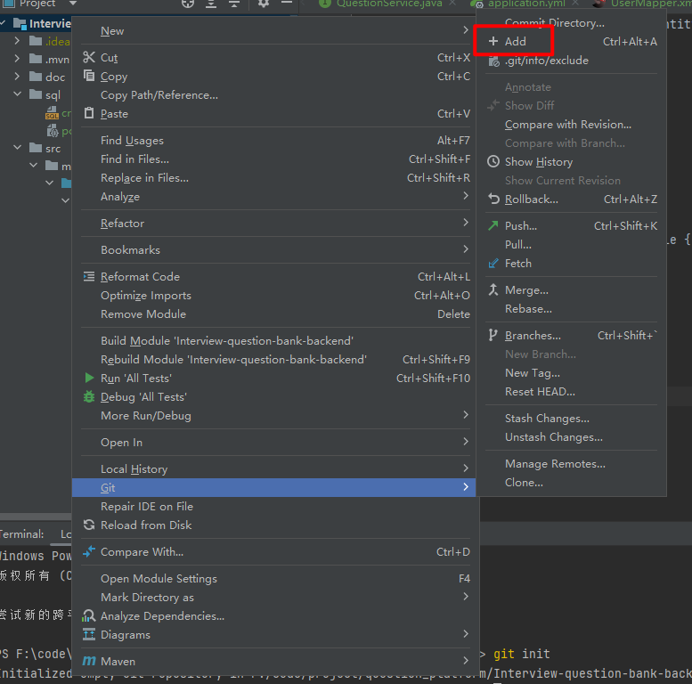
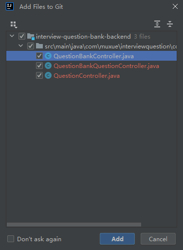

# 1.项目介绍

面试鸭是一款基于 Next.js + Spring Boot + Redis + MySQL + Elasticsearch 的 **面试刷题平台**，运用 Druid + HotKey + Sa-Token + Sentinel 提高了系统的性能和安全性。

管理员可以创建题库、题目和题解，并批量关联题目到题库；用户可以注册登录、分词检索题目、在线刷题并查看刷题记录日历等。

项目涉及大量企业级新技术的讲解，比如使用数据库连接池、热 Key 探测、缓存、高级数据结构来提升性能。通过流量控制、熔断、动态 IP 黑白名单过滤、同端登录冲突检测、分级反爬虫策略来提升系统和内容的安全性。从 0 到 1 的真实企业级项目设计开发，绝对让你收获满满！

### 项目三大阶段

为了帮大家循序渐进地学习，鱼皮将项目设计为三个阶段，可以根据自己的时间和水平按需学习。

1）第一阶段，开发基础的刷题平台，带大家熟悉项目开发流程，实战 Next.js 服务端渲染 + Spring Boot 应用的快速开发。

2）第二阶段，对项目功能进行扩展，精选 4 个真实业务场景，实战企业主流后端技术如 Redis 缓存和高级数据结构、Elasticsearch 搜索引擎、Druid 连接池、并发编程、热 key 探测的应用。

3）第三阶段，对项目安全性进行优化，比如基于 Sentinel 进行网站流量控制和熔断、基于 Nacos 实现动态的 IP 黑白名单、基于 Sa-Token 实现同端登录冲突检测、基于 Redis 实现分级反爬虫策略等。最终将项目上线并保证可用性。

## 1.2、项目优势

### 项目收获

本项目是线上刷题网站[《面试鸭》](https://mianshiya.com/)的教学版本，业务真实典型，基于主流的前端 Next.js 服务端渲染和后端经典技术栈实现。区别于增删改查的 “烂大街” 项目，本项目中鱼皮会带你实战大量新技术和企业级场景、掌握系统设计和优化方案，给你的简历大幅增加竞争力。

鱼皮给大家讲的都是 **通用的项目开发方法和架构设计套路**，从这个项目中你可以学到：

- 如何拆解复杂业务，从 0 开始设计实现系统？
- 如何快速构建 Next.js 服务端渲染网站和后端项目？
- 如何结合 Redis + Caffeine + Hotkey 构建高性能实时缓存？
- 如何利用 Elasticsearch 实现灵活高效的内容搜索？
- 如何巧用 Redisson 高级数据结构，实现高性能的接口？
- 如何实现流量控制和动态 IP 黑白名单，增强网站安全性？
- 如何实现登录冲突检测和分级反爬虫策略，保护网站内容？
- 如何快速上线项目并增强可用性？

此外，还能学会很多作图、思考问题、对比方案的方法，提升排查问题、自主解决 Bug 的能力。

## 1.3、核心业务流程


## 1.4.项目功能梳理

### 基础功能

- 用户模块
- - 用户注册
  - 用户登录（账号密码）
  - 【管理员】管理用户 - 增删改查
- 题库模块
- - 查看题库列表
  - 查看题库详情（展示题库下的题目）
  - 【管理员】管理题库 - 增删改查
- 题目模块
- - 题目搜索
  - 查看题目详情（进入刷题页面）
  - 【管理员】管理题目 - 增删改查（比如按照题库查询题目、修改题目所属题库等）

### 高级功能

- 题目批量管理
- - 【管理员】批量向题库添加题目
  - 【管理员】批量从题库移除题目
  - 【管理员】批量删除题目
- 分词题目搜索
- 用户刷题记录日历图
- 自动缓存热门题目
- 网站流量控制和熔断
- 动态 IP 黑白名单过滤
- 同端登录冲突检测
- 分级题目反爬虫策略

## 1.5技术选型

### 前端

- React 18 框架
- ⭐️ Next.js 服务端渲染
- ⭐️ Redux 状态管理
- Ant Design 组件库
- 富文本编辑器组件
- ⭐️ 前端工程化：ESLint + Prettier + TypeScript
- ⭐️ OpenAPI 前端代码生成

### 后端

- Java Spring Boot 框架 + Maven 多模块构建
- MySQL 数据库 + MyBatis-Plus 框架 + MyBatis X
- Redis 分布式缓存 + Caffeine 本地缓存
- Redission 分布式锁 + BitMap + BloomFilter
- ⭐️ Elasticsearch 搜索引擎
- ⭐️ Druid 数据库连接池 + 并发编程
- ⭐️ Sa-Token 权限控制
- ⭐️ HotKey 热点探测
- ⭐️ Sentinel 流量控制
- ⭐️ Nacos 配置中心
- ⭐️ 多角度项目优化：性能、安全性、可用性

## 1.6、架构设计


## 环境准备

后端 JDK 版本需要使用 8、11 或 17，**不能超过 17！**

推荐使用 11 版本，因为 Caffeine 缓存要求使用 11 版本。

前端 Node.js 版本 >= 18.18。

# 2 - 后端开发

## 2.1、初始化代码

### 下载连接mysql数据库


全选执行


### 更改项目名称

**注意项目名称和包名不能大写**


替换包名


替换，然后搜索


然后执行create_table创建数据库

使用mybatis生成代码


因为原本代码已经存在user类需要自己更改替换

增加  editTime 字段

---

刚生成的几个文件在isDelete字段（是否删除）这里加@TableLogic

```java
    @TableLogic
    private Integer isDelete;
```

在实体类Question，QuestionBank， QuestionBankQuestion

id这里生成策列改一下

```java
    @TableId(type = IdType.ASSIGN_ID)
    private Long id;
```


全局替换库名，然后使用git提交代码


### git初始化代码提交

改完这些已经是你自己的项目了

**测试代码没有问题**就可以提交代码到git了

以后改错了有什么问题可以进行回滚

```
git init
git add .   
或者在根目录选择添加（如下图）
```



然后提交代码


## 2.2.使用代码生成器生成业务代码


题目表

```
        String packageName = "com.muxue.interviewquestion";
        String dataName = "题目";
        String dataKey = "question";
        String upperDataKey = "Question";
```

然后直接点执行


题库表

```
        String packageName = "com.muxue.interviewquestion";
        String dataName = "题库";
        String dataKey = "questionBank";
        String upperDataKey = "QuestionBank";
```

题库题目关联表

```
        String packageName = "com.muxue.interviewquestion";
        String dataName = "题库题目关联表";
        String dataKey = "questionBankQuestion";
        String upperDataKey = "QuestionBankQuestion";
```

复制代码到对应目录

### controller

controller直接可以复制整个文件夹到对应目录



### dto

dto要创建对应的文件夹

这里已question为例

在dto创建文件夹question，复制对应的文件到dto里面


questionBank和questionBankQuestion也一样

### vo

直接复制所有文件到vo文件夹里面

### service

也是和controller一样直接可以复制整个文件夹到对应目录加好


点第三个覆盖所有就好

### 对整理生成的代码进行整理

#### dto和vo，controller

**每一个和实体类对照**确定是否要更多字段添加搜索编辑

如果vo里面的json转换报错就删掉


controller把没有发方法删掉

#### service整理

idea没有安装Generate All Getter And Setter插件可以安装一下

注意需要魔法这里


也可以按下面下载

```
https://plugins.jetbrains.com/plugin/18969-generate-all-getter-and-setter/versions/stable
```


然后选择下载的文件进行安装

使用方法是

```
实体类.allget     就可以一键生成实体类所有字段了
```

在备注报红的，还有不要点赞这些信息就可以删掉了


需要补充就补充一些字段


在这个补充的所有字段里面删除不需要的字段

然后拿到需要的字段来进行查询

## 2.3测试代码

直接访问接口文档进行测试


测试生成的模板中tags需要转换的数据类型都需要加上转换（add,edit,update）

例：editQuestion接口

需要在数据校验前加上，参考post写法

```java
        List<String> tags = questionEditRequest.getTags();
        if (tags != null) {
            question.setTags(JSONUtil.toJsonStr(tags));
        }
```

## 2.4核心业务接口梳理

根据题库查询题目

1.用sql 查询 join连表查询

2.业务层分步查询。要先通过查询关联表得到题目id，再把id放到集合中，根据id使用in查询从题目表查询到题目的完整信息

这里比较简单采用第二种方法

在QuestionBank实体类加上questionBankId（题库id）

安装流程开发controller和service


