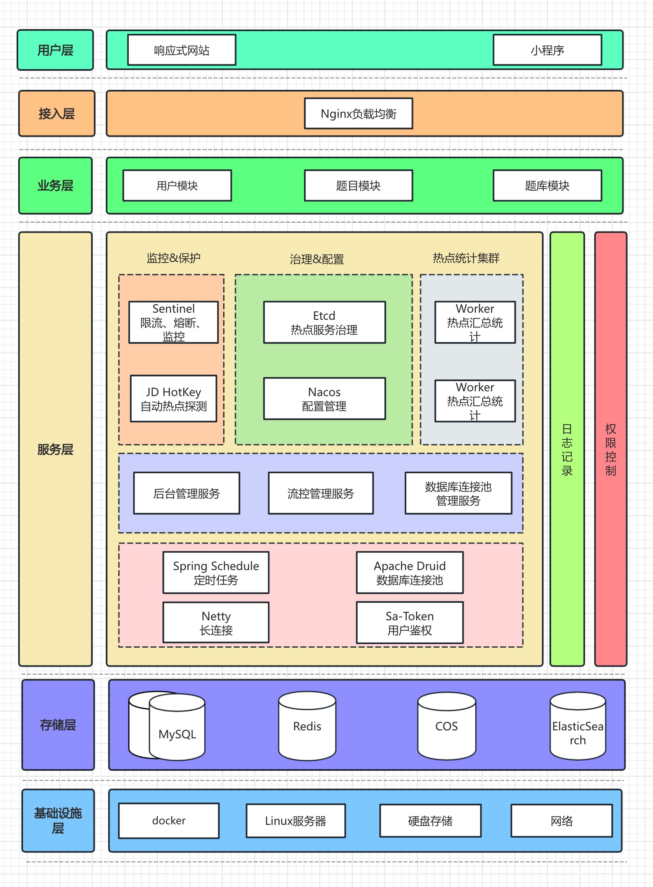
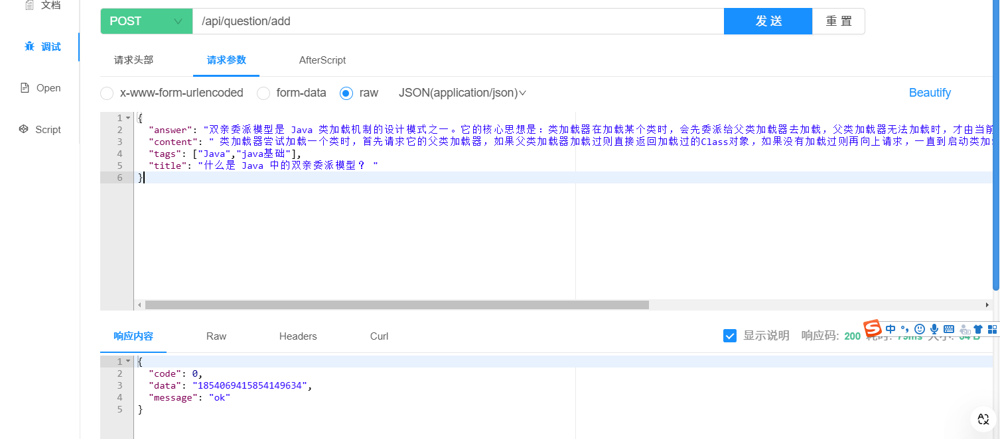

# 1.项目介绍

面试鸭是一款基于 Next.js + Spring Boot + Redis + MySQL + Elasticsearch 的 **面试刷题平台**，运用 Druid + HotKey + Sa-Token + Sentinel 提高了系统的性能和安全性。

管理员可以创建题库、题目和题解，并批量关联题目到题库；用户可以注册登录、分词检索题目、在线刷题并查看刷题记录日历等。

项目涉及大量企业级新技术的讲解，比如使用数据库连接池、热 Key 探测、缓存、高级数据结构来提升性能。通过流量控制、熔断、动态 IP 黑白名单过滤、同端登录冲突检测、分级反爬虫策略来提升系统和内容的安全性。从 0 到 1 的真实企业级项目设计开发，绝对让你收获满满！

### 项目三大阶段

为了帮大家循序渐进地学习，鱼皮将项目设计为三个阶段，可以根据自己的时间和水平按需学习。

1）第一阶段，开发基础的刷题平台，带大家熟悉项目开发流程，实战 Next.js 服务端渲染 + Spring Boot 应用的快速开发。

2）第二阶段，对项目功能进行扩展，精选 4 个真实业务场景，实战企业主流后端技术如 Redis 缓存和高级数据结构、Elasticsearch 搜索引擎、Druid 连接池、并发编程、热 key 探测的应用。

3）第三阶段，对项目安全性进行优化，比如基于 Sentinel 进行网站流量控制和熔断、基于 Nacos 实现动态的 IP 黑白名单、基于 Sa-Token 实现同端登录冲突检测、基于 Redis 实现分级反爬虫策略等。最终将项目上线并保证可用性。

## 1.2、项目优势

### 项目收获

本项目是线上刷题网站[《面试鸭》](https://mianshiya.com/)的教学版本，业务真实典型，基于主流的前端 Next.js 服务端渲染和后端经典技术栈实现。区别于增删改查的 “烂大街” 项目，本项目中鱼皮会带你实战大量新技术和企业级场景、掌握系统设计和优化方案，给你的简历大幅增加竞争力。

鱼皮给大家讲的都是 **通用的项目开发方法和架构设计套路**，从这个项目中你可以学到：

- 如何拆解复杂业务，从 0 开始设计实现系统？
- 如何快速构建 Next.js 服务端渲染网站和后端项目？
- 如何结合 Redis + Caffeine + Hotkey 构建高性能实时缓存？
- 如何利用 Elasticsearch 实现灵活高效的内容搜索？
- 如何巧用 Redisson 高级数据结构，实现高性能的接口？
- 如何实现流量控制和动态 IP 黑白名单，增强网站安全性？
- 如何实现登录冲突检测和分级反爬虫策略，保护网站内容？
- 如何快速上线项目并增强可用性？

此外，还能学会很多作图、思考问题、对比方案的方法，提升排查问题、自主解决 Bug 的能力。

## 1.3、核心业务流程


## 1.4.项目功能梳理

### 基础功能

- 用户模块
- - 用户注册
  - 用户登录（账号密码）
  - 【管理员】管理用户 - 增删改查
- 题库模块
- - 查看题库列表
  - 查看题库详情（展示题库下的题目）
  - 【管理员】管理题库 - 增删改查
- 题目模块
- - 题目搜索
  - 查看题目详情（进入刷题页面）
  - 【管理员】管理题目 - 增删改查（比如按照题库查询题目、修改题目所属题库等）

### 高级功能

- 题目批量管理
- - 【管理员】批量向题库添加题目
  - 【管理员】批量从题库移除题目
  - 【管理员】批量删除题目
- 分词题目搜索
- 用户刷题记录日历图
- 自动缓存热门题目
- 网站流量控制和熔断
- 动态 IP 黑白名单过滤
- 同端登录冲突检测
- 分级题目反爬虫策略

## 1.5技术选型

### 前端

- React 18 框架
- ⭐️ Next.js 服务端渲染
- ⭐️ Redux 状态管理
- Ant Design 组件库
- 富文本编辑器组件
- ⭐️ 前端工程化：ESLint + Prettier + TypeScript
- ⭐️ OpenAPI 前端代码生成

### 后端

- Java Spring Boot 框架 + Maven 多模块构建
- MySQL 数据库 + MyBatis-Plus 框架 + MyBatis X
- Redis 分布式缓存 + Caffeine 本地缓存
- Redission 分布式锁 + BitMap + BloomFilter
- ⭐️ Elasticsearch 搜索引擎
- ⭐️ Druid 数据库连接池 + 并发编程
- ⭐️ Sa-Token 权限控制
- ⭐️ HotKey 热点探测
- ⭐️ Sentinel 流量控制
- ⭐️ Nacos 配置中心
- ⭐️ 多角度项目优化：性能、安全性、可用性

## 1.6、架构设计



## 环境准备

后端 JDK 版本需要使用 8、11 或 17，**不能超过 17！**

推荐使用 11 版本，因为 Caffeine 缓存要求使用 11 版本。

前端 Node.js 版本 >= 18.18。

# 2 - 后端开发

## 2.1、初始化代码

### 下载连接mysql数据库


全选执行


### 更改项目名称

**注意项目名称和包名不能大写**


替换包名


替换，然后搜索


然后执行create_table创建数据库

使用mybatis生成代码


因为原本代码已经存在user类需要自己更改替换

增加  editTime 字段

---

刚生成的几个文件在isDelete字段（是否删除）这里加@TableLogic

```java
    @TableLogic
    private Integer isDelete;
```

在实体类Question，QuestionBank， QuestionBankQuestion

id这里生成策列改一下

```java
    @TableId(type = IdType.ASSIGN_ID)
    private Long id;
```


全局替换库名，然后使用git提交代码


### git初始化代码提交

改完这些已经是你自己的项目了

**测试代码没有问题**就可以提交代码到git了

以后改错了有什么问题可以进行回滚

```
git init
git add .   
或者在根目录选择添加（如下图）
```


然后提交代码


## 2.2.使用代码生成器生成业务代码


题目表

```
        String packageName = "com.muxue.interviewquestion";
        String dataName = "题目";
        String dataKey = "question";
        String upperDataKey = "Question";
```

然后直接点执行


题库表

```
        String packageName = "com.muxue.interviewquestion";
        String dataName = "题库";
        String dataKey = "questionBank";
        String upperDataKey = "QuestionBank";
```

题库题目关联表

```
        String packageName = "com.muxue.interviewquestion";
        String dataName = "题库题目关联表";
        String dataKey = "questionBankQuestion";
        String upperDataKey = "QuestionBankQuestion";
```

复制代码到对应目录

### controller

controller直接可以复制整个文件夹到对应目录


### dto

dto要创建对应的文件夹

这里已question为例

在dto创建文件夹question，复制对应的文件到dto里面


questionBank和questionBankQuestion也一样

### vo

直接复制所有文件到vo文件夹里面

### service

也是和controller一样直接可以复制整个文件夹到对应目录加好


点第三个覆盖所有就好

### 对整理生成的代码进行整理

#### dto和vo，controller

**每一个和实体类对照**确定是否要更多字段添加搜索编辑

如果vo里面的json转换报错就删掉


controller把没有发方法删掉

#### service整理

idea没有安装Generate All Getter And Setter插件可以安装一下

注意需要魔法这里


也可以按下面下载

```
https://plugins.jetbrains.com/plugin/18969-generate-all-getter-and-setter/versions/stable
```


然后选择下载的文件进行安装

使用方法是

```
实体类.allget     就可以一键生成实体类所有字段了
```

在备注报红的，还有不要点赞这些信息就可以删掉了


需要补充就补充一些字段


在这个补充的所有字段里面删除不需要的字段

然后拿到需要的字段来进行查询

## 2.3测试代码

直接访问接口文档进行测试



测试生成的模板中tags需要转换的数据类型都需要加上转换（add,edit,update）

例：editQuestion接口

需要在数据校验前加上，参考post写法

```java
        List<String> tags = questionEditRequest.getTags();
        if (tags != null) {
            question.setTags(JSONUtil.toJsonStr(tags));
        }
```

## 2.4核心业务接口梳理

根据题库查询题目

1.用sql 查询 join连表查询

2.业务层分步查询。要先通过查询关联表得到题目id，再把id放到集合中，根据id使用in查询从题目表查询到题目的完整信息

这里比较简单采用第二种方法

在QuestionQueryRequest加上questionBankId（题库id）

安装流程开发controller和service

是否需要题目列表

QuestionBankQueryRequest加上    

```java
    /**
    *   是否要查询关联题目列表
    * */
    private boolean  needQueryQuestionList;
```

然后在QuestionBankVO类里面加上

返回的题目列表

```java
    /**
     * 题库里的题目列表（分页）
     */
     Page<Question> questionPage;
```

controller

```java
    @GetMapping("/get/vo")
    public BaseResponse<QuestionBankVO> getQuestionBankVOById(QuestionBankQueryRequest questionBankQueryRequest, HttpServletRequest request) {
        Long id = questionBankQueryRequest.getId();
        ThrowUtils.throwIf(id <= 0, ErrorCode.PARAMS_ERROR);
        // 查询数据库
        QuestionBank questionBank = questionBankService.getById(id);
        ThrowUtils.throwIf(questionBank == null, ErrorCode.NOT_FOUND_ERROR);
        QuestionBankVO questionBankVO = questionBankService.getQuestionBankVO(questionBank, request);
        boolean needQueryQuestionList = questionBankQueryRequest.isNeedQueryQuestionList();
        if (needQueryQuestionList){
            QuestionQueryRequest questionQueryRequest = new QuestionQueryRequest();
            questionQueryRequest.setQuestionBankId(id);
            Page<Question> questionPage = questionService.listQuestionByPage(questionQueryRequest);
            questionBankVO.setQuestionPage(questionPage);
        }
        // 获取封装类
        return ResultUtils.success(questionBankVO);
    }
```

修改题目所属数据库接口

添加移除关联表字段

```java
/**
 * 删除题目题库关系请求
 */
@Data
public class QuestionBankQuestionRemoveRequest implements Serializable {
    /**
     * 题库 id
     */
    private Long questionBankId;

    /**
     * 题目 id
     */
    private Long questionId;

    private static final long serialVersionUID = 1L;
}
```

#### 创建题库题目关联

```java
@Override
public void validQuestionBankQuestion(QuestionBankQuestion questionBankQuestion, boolean add) {
    ThrowUtils.throwIf(questionBankQuestion == null, ErrorCode.PARAMS_ERROR);
    // 题目和题库必须存在
    Long questionId = questionBankQuestion.getQuestionId();
    if (questionId != null) {
        Question question = questionService.getById(questionId);
        ThrowUtils.throwIf(question == null, ErrorCode.NOT_FOUND_ERROR, "题目不存在");
    }
    Long questionBankId = questionBankQuestion.getQuestionBankId();
    if (questionBankId != null) {
        QuestionBank questionBank = questionBankService.getById(questionBankId);
        ThrowUtils.throwIf(questionBank == null, ErrorCode.NOT_FOUND_ERROR, "题库不存在");
    }
}
```

因为 QuestionService 和 QuestionBankQuestionService 互相引用，会导致循环依赖问题，让项目无法启动。可以通过给 QuestionBankQuestionServiceImpl 中引用 QuestionService 的位置加上 `@Lazy` 注解解决。

```java
@Resource
@Lazy
private QuestionService questionService;
```


# 3.前端模板开发

## 一、本项目选型

- React 18 框架
- ⭐️ Next.js 服务端渲染
- ⭐️ Redux 状态管理
- Ant Design 组件库
- 富文本编辑器组件
- ⭐️ 前端工程化：ESLint + Prettier + TypeScript
- ⭐️ OpenAPI 前端代码生成

## 二、服务端渲染介绍

#### 1、什么是客户端和服务端渲染？

网站渲染可以在服务端和客户端两种环境下进行。

服务端渲染（Server-Side Rendering，SSR） 是一种将网页在 **服务器端** 生成并渲染为 HTML 内容的技术。在这种方式下，当用户请求一个网页时，服务器会提前调用后端能获取数据并生成完整的 HTML 文档，然后将其发送到客户端（浏览器）。浏览器接收到 HTML 后，直接展示页面内容，不用再动态地向后端发送请求来获取数据。

服务端渲染的工作流程通常如下：

1. 用户发送请求到服务器
2. 服务器处理请求，调用后端获取数据，并生成完整的 HTML 页面
3. 服务器将生成的 HTML 页面返回给客户端（浏览器）
4. 浏览器接收到 HTML 后，直接渲染页面

#### 2、客户端和服务端渲染的区别？

客户端渲染和服务端渲染的主要区别在于渲染过程发生的地点。

由于 Ajax、Vue、React 等新技术的崛起，大多数学前端的同学开发的网站都是基于客户端渲染实现的，客户端渲染的优点主要是：

1. 开发方便灵活：开发者不需要区分哪些数据要在服务端加载、哪些数据要在客户端加载，也不用担心哪些 API 无法在服务端使用。便于实现更加复杂和动态的用户界面，适合构建单页应用（SPA）和需要频繁交互的应用。
2. 减少服务器压力：由于渲染工作由客户端（用户自己的电脑）完成，因此服务器的负载相对较小，只需要提供静态资源（比如使用 Nginx 就能完成部署）。

以我们的 [编程导航网站](https://www.code-nav.cn/) 为例，就使用了客户端渲染，可以看到刚开始加载的 HTML 文档并不包含网站的数据，只有一个标题、以及一个 JS 脚本。

而我们的 [面试刷题网站 - 面试鸭](https://www.mianshiya.com/) 使用的是服务端渲染，可以看到，服务端返回的 HTML 文档中，就已经有完整的网站数据和样式了：

1. 减少初始加载时间：SSR 页面可以在首次加载时展示完整内容，减少白屏时间，而 CSR 通常需要等待 JavaScript 加载和执行后才能展示内容。
2. SEO 友好：SSR 更有利于 SEO，因为搜索引擎爬虫能够直接抓取完整页面的内容，而不依赖于 JavaScript 执行。

但相应的，SSR 将渲染任务交给服务器，可能会增加服务器的负载和压力。所以 SSR 更适合追求性能和 SEO 的企业级项目。

能够实现服务端渲染的技术很多，以前有 Java 的 JSP、PHP 等等，现在有基于 React 的 Next.js 和基于 Vue 的 Nuxt.js 框架，可以让你直接用前端的语法开发服务端渲染项目。

#### 3、其他渲染方式 - 静态网站生成

静态网站生成（Static Site Generation，SSG）是一种在构建阶段生成静态 HTML 文件的技术。与服务端渲染不同，静态网站生成是在构建时（而不是用户请求时）生成页面，所有页面都以静态文件的形式存在。

这种方式本质上也是客户端渲染，但是不需要由客户端再动态地向后端发送请求来获取数据，这些静态文件可以直接由内容分发网络（CDN）或静态服务器提供。

优点：

1. 高性能：由于服务器仅需提供静态文件，性能极高；而且由于数据不变化，特别适合通过 CDN 缓存加速。
2. SEO 友好：搜索引擎最喜欢的就是静态 HTML 文件，可以轻松索引并提升 SEO 效果。
3. 简化基础设施：无需复杂的前后端交互逻辑，静态文件的部署和维护成本较低。

缺点：

1. 动态内容有限：SSG 适合内容变化不频繁的场景，对于需要实时更新内容的网站，生成静态页面可能不够灵活。
2. 构建时间：生成大量静态页面时，构建时间可能较长，特别是数据量大的时候。

基于这些优缺点，静态网站生成适合内容数量有限的、内容基本不变的网站，比如个人博客。像 VuePress、Hugo、Hexo、Astro 都是主流的静态网站生成器。

[鱼皮的编程宝典](https://www.codefather.cn/) 就是基于 VuePress 开发的，模板也开源到了 GitHub 上：https://github.com/liyupi/codefather

随着静态网站内容越来越多，每次构建会越来越慢，这种情况下，可以采用增量静态生成技术。

增量静态生成（Incremental Static Regeneration，ISR）允许部分页面在构建之后进行更新，而无需重新构建整个站点。这种技术适用于那些大多数内容不变、但某些部分需要动态更新的网站。

工作流程：

1. 在构建阶段，生成初始的静态页面。
2. 当页面内容更新时，通过配置的再生成间隔，静态页面可以增量更新，而不是重新生成整个站点，大幅减少构建时间。
3. 用户请求时，如果页面内容过期或更新，则后台自动生成新的静态页面并缓存。

这样一来，可以在享受静态网站高性能、SEO 友好特性的同时，及时更新网站的内容，并减少构建时间。

不过缺点就是架构更复杂、维护成本更高。但值得一提的是，很多大型网站为了做 SEO 优化，专门把动态网站转为静态 HTML（静态化）。

#### 4、结合使用（推荐）

实际情况下，前面讲到的几种方式可以结合使用。

比如 **部分预渲染**（Partial Prerendering，PPR）是一种将服务端渲染（或静态生成）与客户端渲染结合的技术。

工作流程：

1. 在构建阶段或请求阶段，页面的静态部分预先渲染（如导航栏、页脚等）。
2. 页面加载时，静态部分直接显示，动态部分由 JavaScript 在客户端加载并渲染。
3. 通过水合（Hydration）过程，客户端的 JavaScript 接管已经渲染的静态内容，并继续处理动态交互。

这样一来，兼具了 SSR 的 SEO 友好和快速初始加载、以及 CSR 灵活动态交互的优点。

还有一个跟部分预渲染相似的概念叫 **同构渲染** ，是指同一套代码可以在服务端和客户端运行，并在服务端渲染页面的初始内容，然后在客户端接管渲染和交互。

实际情况下鱼皮也更推荐用这种方式，本项目鱼皮也会带大家使用主流的、新版本的 Next.js 框架实现同构渲染。下面先从 0 开始带大家做一个基于 Next.js 的前端万用项目模板。

## 三、Next.js 前端万用模板开发

自主打造一套前端开发项目模板！

### 确认环境！！！

打开 Next.js 的官方文档：https://nextjs.org/docs/getting-started/installation （注意不要看成国内的文档了，不够新）

本次我们要使用的是 14 版本的 Next.js，可以看到 Node.js 的版本要求必须 >= 18.18，一定要注意！


### 创建项目

直接按照官方文档的指引，使用 Npm 自带的 Npx 脚手架工具 `create-next-app` 来自动安装 Next.js 初始化项目：https://nextjs.org/docs/getting-started/installation#automatic-installation

在需要安装的文件夹内执行安装命令：

```
npx create-next-app@latest
```

由于 Ant Design 5.x 只支持react18版本  最新的next为15.0.3我们需要指定版本安装

```
npx create-next-app@14.2.18
```


脚手架会自动生成代码并安装依赖，如果安装依赖卡住，可能需要更换 Npm 镜像为国内源：

```
npm config set registry https://registry.npmmirror.com/
```

完成后打开

进入项目运行项目打开出现页面


### 前端工程化配置

脚手架已经帮我们配置了 ESLint 自动校验、TypeScript 类型校验，但一般情况下，我们还需要代码自动格式化插件 Prettier，需要手动整合。

整合多个工具时，很容易出现版本冲突的问题，尤其是 ESlint 和 Prettier 整合时，校验规则可能也会存在冲突。所以最好按照官方文档的指引，比如：https://nextjs.org/docs/app/api-reference/config/eslint


```shell
npm install --save-dev eslint-config-prettier
 
yarn add --dev eslint-config-prettier
 
pnpm add --save-dev eslint-config-prettier
 
bun add --dev eslint-config-prettier
```

先去官网安装 prettier（ https://prettier.io/docs/en/install ），执行命令：

```shell
npm install --save-dev --save-exact prettier
```

然后通过命令安装整合包 eslint-config-prettier：

```json
{
  "extends": ["next/core-web-vitals", "next/typescript","prettier"]
}
```

然后在编辑器中搜索prettier


在任意一个 tsx 文件中执行格式化快捷键（Ctrl + Alt + L），不报错，表示配置工程化成功。

修改 .eslintrc.json 文件可以改变校验规则，一般自己做项目不需要修改，具体可以到 ESLint 和 Prettier 的官方文档查看。

如果不使用脚手架，就需要自己按照下面这些文档整合这些工具：

- 代码规范：https://eslint.org/docs/latest/use/getting-started
- 代码美化：https://prettier.io/docs/en/install.html
- 直接整合：https://github.com/prettier/eslint-plugin-prettier#recommended-configuration （包括了 https://github.com/prettier/eslint-config-prettier#installation ）

### 引入组件库

1）Ant Design 是 React 项目主流的组件库，Ant Design Procomponents 是在此基础上进一步封装的高级业务组件库，一般的项目使用这两个就足够了，我们的 [面试鸭](https://www.mianshiya.com/) 用的就是这些，完全满足需求。

参考官方文档在 Next.js 项目中引入 Ant Design 5.x 版本的组件库：https://ant-design.antgroup.com/docs/react/use-with-next-cn

引入 antd

```
npm install antd --save
```

使用 App Router以避免页面闪动的情况

```
npm install @ant-design/nextjs-registry --save
```

在 `app/layout.tsx` 中使用

```jsx
// import type {Metadata} from "next";
import localFont from "next/font/local";
import "./globals.css";
import { AntdRegistry } from '@ant-design/nextjs-registry';

const geistSans = localFont({
    src: "./fonts/GeistVF.woff",
    variable: "--font-geist-sans",
    weight: "100 900",
});
const geistMono = localFont({
    src: "./fonts/GeistMonoVF.woff",
    variable: "--font-geist-mono",
    weight: "100 900",
});


// 网页的标题描述
// export const metadata: Metadata = {
//     title: "Create Next App",
//     description: "Generated by create next app",
// };


export default function RootLayout({
                                       children,
                                   }: Readonly<{
    children: React.ReactNode;
}>) {
    return (
        <html lang="en">
        <body className={`${geistSans.variable} ${geistMono.variable}`}>
        <AntdRegistry>{children}</AntdRegistry>
        </body>
        </html>
    );
}
```

引入之后找一个组件测试一下是否引入成功

我这里在page页面引入一个基础按钮测试

```
import {Button} from "antd";

<Button type="primary">Primary Button</Button>
```

我们还可以引入 Ant Design Procomponents

文档：https://procomponents.ant.design/docs/

ProComponents 每一个组件都是一个独立的包，你需要在你的项目中安装对应的 npm 包并使用。

```
npm i @ant-design/pro-components --save
```

精减globals.css全局样式

```css
html,
body {
  max-width: 100vw;
  min-height: 100vh;
}
* {
  box-sizing: border-box;
  padding: 0;
  margin: 0;
}

a {
  color: inherit;
  text-decoration: none;
}
```

在根目录新建public/assets存放静态资源

配置src/app/layout.tsx

```tsx
// import type {Metadata} from "next";
import localFont from "next/font/local";
import "./globals.css";
import { AntdRegistry } from '@ant-design/nextjs-registry';
import BasicLayout from "@/app/layouts/BasicLayout";

const geistSans = localFont({
    src: "./fonts/GeistVF.woff",
    variable: "--font-geist-sans",
    weight: "100 900",
});
const geistMono = localFont({
    src: "./fonts/GeistMonoVF.woff",
    variable: "--font-geist-mono",
    weight: "100 900",
});


// 网页的标题描述
// export const metadata: Metadata = {
//     title: "Create Next App",
//     description: "Generated by create next app",
// };


export default function RootLayout({
                                       children,
                                   }: Readonly<{
    children: React.ReactNode;
}>) {
    return (
        <html lang="en">
        <body className={`${geistSans.variable} ${geistMono.variable}`}>
        <AntdRegistry>
        <BasicLayout>
            {children}
        </BasicLayout>
        </AntdRegistry>
        </body>
        </html>
    );
}
```

src/layouts/BasicLayout

```tsx
"use client"
import {GithubFilled, InfoCircleFilled, LogoutOutlined, QuestionCircleFilled, SearchOutlined,} from '@ant-design/icons';
import {ProConfigProvider, ProLayout,} from '@ant-design/pro-components';
import {Dropdown, Input, theme,} from 'antd';
import React from 'react';
import {Props} from "next/script";
import Image from "next/image";
import {usePathname} from "next/navigation";
import Link from "next/link";
import GlobalFooter from "@/components/GlobalFooter";
import "./index.css"
import {menus} from "../../../../config/menu";

const SearchInput = () => {
    const {token} = theme.useToken();
    return (
        <div
            key="SearchOutlined"
            aria-hidden
            style={{
                display: 'flex',
                alignItems: 'center',
                marginInlineEnd: 24,
            }}
            onMouseDown={(e) => {
                e.stopPropagation();
                e.preventDefault();
            }}
        >
            <Input
                style={{
                    borderRadius: 4,
                    marginInlineEnd: 12,
                    backgroundColor: token.colorBgTextHover,
                }}
                prefix={
                    <SearchOutlined
                        style={{
                            color: token.colorTextLightSolid,
                        }}
                    />
                }
                placeholder="搜索方案"
                variant="borderless"
            />
        </div>
    );
};

export default function BasicLayout({children}: Props): React.ReactElement {

    const pathname = usePathname()

    return (
        <div
            id="test-pro-layout"
            style={{
                height: '100vh',
                overflow: 'auto',
            }}
        >
            <ProConfigProvider hashed={false}>
                <ProLayout
                    prefixCls="my-prefix"
                    location={{
                        pathname,
                    }}
                    token={{
                        header: {
                            colorBgMenuItemSelected: 'rgba(0,0,0,0.04)',
                        },
                    }}
                    layout={'top'}
                    title={"面试刷题平台"}
                    logo={
                        <Image src="/assets/logo.png" width={32} height={32} alt={"muxuetianyin-刷题网站"}/>
                    }
                    siderMenuType="group"
                    menu={{
                        collapsedShowGroupTitle: true,
                    }}
                    avatarProps={{
                        src: 'https://gw.alipayobjects.com/zos/antfincdn/efFD%24IOql2/weixintupian_20170331104822.jpg',
                        size: 'small',
                        title: '七妮妮',
                        render: (props, dom) => {
                            return (
                                <Dropdown
                                    menu={{
                                        items: [
                                            {
                                                key: 'logout',
                                                icon: <LogoutOutlined/>,
                                                label: '退出登录',
                                            },
                                        ],
                                    }}
                                >
                                    {dom}
                                </Dropdown>
                            );
                        },
                    }}
                    actionsRender={(props) => {
                        if (props.isMobile) return [];
                        // if (typeof window === 'undefined') return [];
                        return [
                            props.layout !== 'side' && document.body.clientWidth > 1400 ? (
                                <SearchInput/>
                            ) : undefined,
                            <InfoCircleFilled key="InfoCircleFilled"/>,
                            <QuestionCircleFilled key="QuestionCircleFilled"/>,
                            <GithubFilled key="GithubFilled"/>,
                        ];
                    }}
                    headerTitleRender={(logo, title) => {
                        const defaultDom = (
                            <a>
                                {logo}
                                {title}
                            </a>
                        );
                        // if (typeof window === 'undefined') return defaultDom;
                        // if (document.body.clientWidth < 1400) {
                        //     return defaultDom;
                        // }
                        // if (_.isMobile) return defaultDom;
                        return (
                            <>
                                {defaultDom}
                            </>
                        );
                    }}
                    footerRender={() => {
                        return (
                           <GlobalFooter/>
                        );
                    }}
                    onMenuHeaderClick={(e) => console.log(e)}
                    menuDataRender={() => {
                        return menus
                    }}
                    menuItemRender={(item, dom) => (
                        <Link
                            href={item.path || "/"}
                            target={item.target}
                        >
                            {dom}
                        </Link>
                    )}
                >
                    {children}
                </ProLayout>
            </ProConfigProvider>
        </div>

    );
};
```

src/layouts/BasicLayout/index.css

```css
.ant-pro-layout .ant-pro-layout-content {
    padding-bottom: 96px !important;
}
```

项目根目录/config/menus

```tsx
import {MenuDataItem} from "@umijs/route-utils";
import {CrownOutlined} from "@ant-design/icons";

// 菜单列表
export const menus = [
    {
        path: '/',
        name: '主页'
    },
    {
        path: 'questions',
        name: '题目'
    },
    {
        path: 'banks',
        name: '题库'
    },
    {
        path: "/admin",
        name: "管理",
        icon: <CrownOutlined />,
        children: [
            {
                path: "/admin/user",
                name: "用户管理",
            }
        ],
    },
] as MenuDataItem[];
```

全局底部栏组件

src/components/GlobalFooter

```tsx
import React from "react";
import './index.css'

/**
 * 全局底部栏组件
 * @constructor
 */


export default function GlobalFooter() {
    const currentYear = new Date().getFullYear();
    return (
        <div
            className="global-footer"
        >
            <div>© {currentYear} 面试猫</div>
            <div>
                <a href="https://www.muxuetianyin.cn" target="_blank" rel="noopener noreferrer">
                    muxuetianyin-苏永儿
                </a>
            </div>
        </div>
    );
}
```

src/components/GlobalFooter/index.css

```css
.global-footer{
    position: fixed;
    bottom: 0;
    text-align: center;
    background-color: #f2f2f2;
    padding: 16px;
    width: 100%;
}
```

### 引入asiox

src/libs/request.ts

```ts
import axios from "axios";

// 创建 Axios 示例
const myAxios = axios.create({
  baseURL: "http://localhost:8101",
  timeout: 10000,
  withCredentials: true,
});

// 创建请求拦截器
myAxios.interceptors.request.use(
  function (config) {
    // 请求执行前执行
    return config;
  },
  function (error) {
    // 处理请求错误
    return Promise.reject(error);
  },
);

// 创建响应拦截器
myAxios.interceptors.response.use(
  // 2xx 响应触发
  function (response) {
    // 处理响应数据
    const { data } = response;
    // 未登录
    if (data.code === 40100) {
      // 不是获取用户信息接口，或者不是登录页面，则跳转到登录页面
      if (
        !response.request.responseURL.includes("user/get/login") &&
        !window.location.pathname.includes("/user/login")
      ) {
        window.location.href = `/user/login?redirect=${window.location.href}`;
      }
    } else if (data.code !== 0) {
      // 其他错误
      throw new Error(data.message ?? "服务器错误");
    }
    return data;
  },
  // 非 2xx 响应触发
  function (error) {
    // 处理响应错误
    return Promise.reject(error);
  },
);

export default myAxios;
```

### 自动生成请求代码

传统情况下，每个请求都要单独编写代码，很麻烦。

推荐使用 OpenAPI 工具，直接自动生成即可：https://www.npmjs.com/package/@umijs/openapi

按照官方文档的步骤，先安装：

```
npm i --save-dev @umijs/openapi
```

在 **项目根目录** 新建 `openapi.config.ts`，根据自己的需要定制生成的代码：

```ts
const { generateService } = require("@umijs/openapi");

generateService({
  requestLibPath: "import request from '@/libs/request'",
  schemaPath: "http://localhost:8101/api/v2/api-docs",
  serversPath: "./src",
});
```

在 package.json 的 script 中添加 `"openapi": "ts-node openapi.config.ts"`

```
npm install -g ts-node  
```

运行openapi


这样说明运行成功了

### 初始化页面

可以将单次调用的函数封装成组件像ant design包裹

```jsx
const InitLayout: React.FC<Readonly<{
    children: React.ReactNode;
}>> = ({children}) => {

    /**
     * 全局初始化函数，有单次调用的代码
     */
    // useCallback 缓存函数  []中的变量不发生改变就不会出现渲染
    const doInit = useCallback(() => {
        console.log("init")
    }, [])

    // 在next.js中开发环境useEffect会执行两次
    useEffect(() => {
        doInit()
    }, []);

    return (
        children
    )
}
```

RootLayout

```jsx
export default function RootLayout({
                                       children,
                                   }: Readonly<{
    children: React.ReactNode;
}>) {


    return (
        <html lang="en">
        <body className={`${geistSans.variable} ${geistMono.variable}`}>
        <AntdRegistry>
            <InitLayout>
                <BasicLayout>
                    {children}
                </BasicLayout>
            </InitLayout>
        </AntdRegistry>
        </body>
        </html>
    );
}
```

### 全局状态管理

#### 1、什么是全局状态管理？

是指多个页面需要共享或者跟踪变化的变量，可以放到全局来统一维护，而不是每个页面分别维护和获取。

适合作为全局状态的数据：已登录用户信息（每个页面几乎都要用）1668065268082946050_0.4089253679568121

在 Vue 中，主流的状态管理库有 Vuex 和 Pinia；在 React 项目中，主流的状态管理库是 Redux，本项目也将使用它。

#### 2、Redux 基本概念

React Redux 官方文档：https://react-redux.js.org/1668065268082946050_0.2389180497465926

Redux 中有一些常用的核心概念，不用理解，简单了解一下即可。

1）Store：整个应用状态（state）的容器，负责存储应用的状态，并提供访问状态、派发（dispatch）动作以及注册监听器等功能。

2）Action：一个普通的 JavaScript 对象，描述了状态变化的意图。每个 `action` 必须包含一个 `type` 字段，表示动作类型。1668065268082946050_0.35505414725423856

一般开发中，我们会用一个字符串常量（Action Types）来标识不同的动作类型。比如改变计数器需要的 increment 或 decrement：

```
const INCREMENT = 'INCREMENT';
const DECREMENT = 'DECREMENT';
```

还会用 Action Creators 动作创建器函数来生成 action 对象，比如：

```
const increment = () => ({
  type: INCREMENT,
});

const decrement = () => ({
  type: DECREMENT,
});
```

3）Dispatch：用于发送 action，触发状态更新。

4）Reducer：俗称状态处理器，根据当前状态和传入的 action 返回新的状态的函数。比如：

```
const initialState = { count: 0 };

function counterReducer(state = initialState, action) {
  switch (action.type) {
    case INCREMENT:
      return { ...state, count: state.count + 1 };
    case DECREMENT:
      return { ...state, count: state.count - 1 };
    default:
      return state;
  }
}
```

